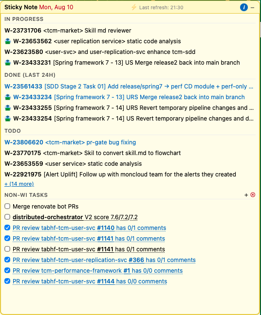
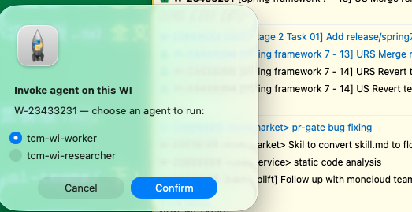
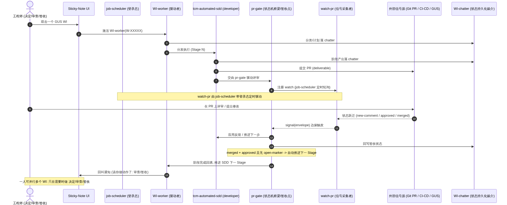
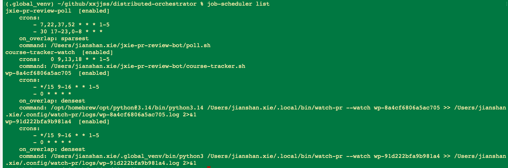
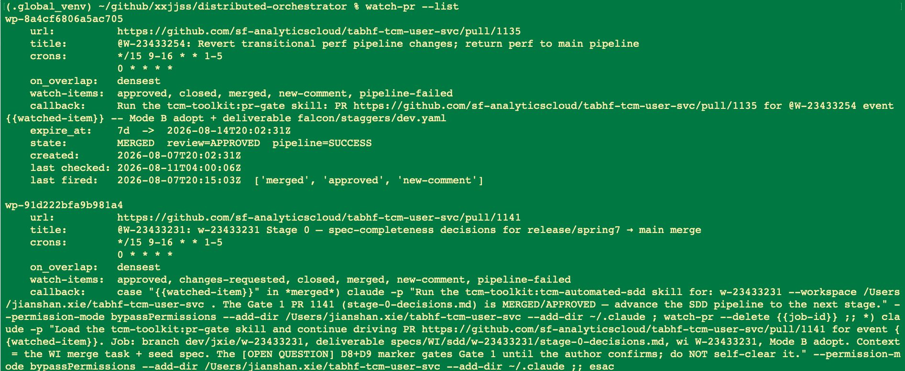

# 分布式 AI Agent 编排系统 — 项目可行性报告

> 本文是**项目可行性报告**，覆盖现状、痛点、分期、要实现的功能、带来的益处与未来前景，
> 主要面向**产品审核与公司领导层**。与之配套的**技术设计文档**（系统结构、各部分功能的
> 选型与实现，面向技术审核人）见 [`distributed-orchestrator-tech-design.md`](./distributed-orchestrator-tech-design.md)。
> 两文交叉引用、内容互补：本文谈「为什么做、做成什么、值不值得」，技术设计文档谈「怎么做」。

---

## 0. 执行摘要（Executive Summary）

### 0.0 决策摘要卡（30 秒决策视图，回应 leadership reviewer P1）

> 一页看清 **Ask → 预期收益 → Top 风险 → go/no-go 建议 + 门槛**。细节见对应小节。

| 项 | 内容 |
|---|---|
| **要什么（Ask）** | **1 个季度 · 1–2 名工程师 · 复用作者已有原型 · 依赖外部 `matrix` 托管**（未就绪可回退本机 worker）。只批"内部研发效率试点"，不批"商业产品"。 |
| **一期预期收益** | 把作者本人的「≈3× 个人产出」信号，验证为**团队可复现的 WI 吞吐 ≥1.5×**（Engineer360 对照口径）；沉淀可被 FDE 与 Agentforce 复用的编排内核。 |
| **一期成本量级** | 人力 ≈ **11–24 人周**（档位取决于 OQ-1）；云资源 **几十至低几百美元/月**；**LLM Token ≈ $1.5k–9k/月**（Sonnet 档，Opus 数倍，待 claude-api 核准，§3a）。 |
| **Top-3 风险** | ① 与 Agentforce/Platform 编排能力**重复投资**（须战略层裁决）；② `matrix` 依赖排期（有本机 worker 退路）；③ ROI 仍是 n=1，团队复现未发生。 |
| **决策建议** | **条件性 GO（Conditional GO）**——见 §0.4。低风险的战略期权：小注押注与公司头号战略（Agentforce 数字劳动力）同向的能力，用一个季度买"要不要加码"的信息。 |
| **go/no-go 门槛** | **闸门 A（投钱前）**：战略层对"编排层归属/非重复投资"署名裁决（OQ-3）+ 指派 OQ-1 owner。**闸门 B（二期前）**：一期试点跑出 §0.4 的 4 条 gate。 |

**一句话定位**：我们要造的不是又一个 AI agent，而是让**任何 AI agent / skill / 脚本能够 7×24 无人值守、幂等、断点续跑、并被统一编排**的「分布式操作系统层」——先在公司内部把工程师的研发效率规模化，再沿清晰的产品化路径走向商用。

**分期主线（一句话记住我们的节奏）**：**一期推工具，二期推环境，长期推产品**（回应 human comment）。
- **一期 = 推工具**：面向公司内部工程师，交付一个能把「WI 全自动推进」规模化的编排器工具，先自证价值。
- **二期 = 推环境**：把编排内核沉淀为 SDK + 统一消息/事件环境，让公司内其他团队与其他工作流低门槛接入，并与 SF 产品线（Slack/Tableau/MuleSoft/Agentforce）耦合。
- **长期 = 推产品**：模版 + 图形化编排 + 封装的持久化/消息/鉴权，包装为可商用的编排产品，走向 FDE 与终端客户。

### 0.1 为什么是现在（Why — 从现状痛点归纳）

> 以下痛点由「设计思路」归纳、整理、润色后在此复述，作为立项的 **why**。人类评审员在 presentation 时**只读本文**、不读设计思路（回应 human comment）。

公司已把 Claude Code / opencode 铺成开发平台，工程师已自发写出大量 skill / agent / workflow。但这些工具的价值被一连串结构性痛点锁死：

| # | 现状痛点 | 后果 | 谁来解 |
|---|---|---|---|
| **P1 无处托管** | 没有一个可 7×24 不停机运行的 AI 工具箱/托管平台 | AI 工具只能在开发者本机、有人盯着时才跑 | `matrix`（falcon 上的公司内部托管平台）解决「在哪跑」——**外部项目，非本项目交付** |
| **P2 自动化程度低、非幂等** | 现有 AI 过程大多半自动、状态不保证幂等、重入需人工介入；要做到幂等缺状态持久化机制，**开发门槛高** | 工作流断了要人接管、从头重来；每个开发者重复造持久化轮子 | **本项目**：状态持久化 + 幂等状态机 + 最小 SDK |
| **P3 缺友好的人机消息平台** | 仍主要依赖 Claude Code/opencode 的 CLI；**界面对非专业人士堪称恐怖**；多 session 难跟踪、难管理 | 非专业用户被挡在门外；多任务并行时人被界面淹没 | **本项目**：面向工作流的 UI + 通知/审批闭环（sticky-note 起步） |
| **P4 无法自动重跑** | 关机/断网/网络抖动会打断本地 AI 工作流，**不得不从头运行**；「写码-提交-review-修订-测试-回归」这类长工作流要数小时，**不能关机、需频繁手工保状态** | 长工作流的时间成本被「人必须全程在场」放大 | **本项目**：中断容错（断点续跑）+ 云端单一事实源 |
| **P5 学习/使用成本高** | 即便资深工程师，用 AI 自动化日常工作、提效都是高学习成本的痛点；对 Salesforce 终端用户更是「说起来容易、却没有可用工具」——导致 **AI 在终端用户手中基本仍等同于 chatbot** | 提效红利集中在极少数会「攒工具链」的人手里，无法规模化 | 一期降门槛、远期图形化编排让终端用户可编排 |

**关键洞察**：`matrix` 解决了 P1「在哪跑」，但**没解决 P2 跑不稳/不幂等、P3 触达不到人、P4 断了续不上、P5 门槛高**——后四条正是本项目的空位。托管 ≠ 编排。

### 0.2 早期信号（须诚实标注，见 §2c 与技术设计 D5）

作者本人用自建的一套原型工具（wi-researcher/wi-worker 自动化 + sticky-note 人机界面 + WI-chatter 状态持久化 + PR/Slack/GUS 监听 + 本机带登录态的 job scheduler），已能**同时并行推进 4–5 个 WI、全程无需在 CLI 内交互**，Engineer360 口径下产出约为团队他人的 **3×**。

这是 **n=1、作者本人、归因未隔离、代理指标（WI 数 + 代码量）**的早期个人信号，**不是产品级结论**。本报告据此提出**可规模化验证的试点假设 + 度量方案**（§2c、§3a），把它当立项理由而非既成事实。

### 0.2.1 一期实战一览（用真实原型证据打动决策层，回应 human comment）

> 以下截图与实例均来自作者**已在跑的原型**——不是概念图，而是每天在用的东西。它们把"编排器如何让一个人并行推进多个 WI、只在关键点介入"讲成可见的故事。

**（1）人机界面 = sticky-note：一屏看清 + 一键驱动**

sticky-note 面板把 GUS WI 按 **In Progress / Done / Todo** 分组呈现（顶部即本报告 `distributed-orchestrator` 的评审进度 `V2 score 7.6/7.2/7.2`），它同时是**驱动 WI 的入口**——双击一个 WI 即弹出"选择 agent 运行"（下图），激活 WI-worker。底部 **NON-WI TASKS** 既可用户自定义待办，也承接 **AI 的回叫提示**（如"PR review … has 0/1 comments"，提醒该你去做决定/审查）。这正是 §3a 用户旅程的落地形态。

**（2）一个 WI 从头到尾的自动推进（真实实例）**

真实实例：GUS `W-23433231`（[WI 链接](https://gus.lightning.force.com/lightning/r/ADM_Work__c/a07EE00002edkFOYAY/view)）。从该 WI 的 **chatter**（此处临时把 chatter 当作状态持久化的介质）可以看出：WI 由 **WI-worker 驱动**并分发给 **tcm-automated-sdd** 执行；每个阶段的 AI 产出可见、提交 PR、**人机通过 PR 交互**、merge 后**自动推进到下一步**，直到最后完成。下图把这条链路的组件与交互画成端到端示意：

> 图中组件：**WI-worker**（驱动者）、**tcm-automated-sdd**（developer）、**pr-gate**（状态机桥梁 / 人类反馈、检查、签收点）、**WI-chatter**（状态持久化媒介）、**watch-pr**（信号采集者）、**job-scheduler**（驱动状态采集，见下）、**Git PR / CI-CD / GUS**（外部信号源）。
> **关键效益**：因为人类通过人机界面**及时知道需要进行的操作**，一个人可以**同时处理多个 WI**——只需做 **make decision / review / sign-off** 三件事，其余交给编排器。这就是"3× 个人信号"的机制来源，也是一期要规模化验证的东西。

**（3）状态采集的驱动器 = 带登录态的 job-scheduler（不同于 crontab）**

`job-scheduler` 是一个**带 login session** 的作业调度器（区别于无登录态的 crontab）——正因带登录态，它定时驱动的回调才能直接跑 `claude -p` / `watch-pr`。图中每个 `wp-*` 条目就是一个被定时驱动的 watch-pr 采集任务。

**（4）信号采集者 = watch-pr（边缘触发 + 回调驱动状态机）**

`watch-pr --list` 显示每个被监听 PR 的 `watch-items`（`approved / merged / new-comment / pipeline-failed …`）、`state`（如 `MERGED review=APPROVED pipeline=SUCCESS`）与 `callback`。当 PR 状态**跃迁**（如 merged/approved），watch-pr 触发 callback——正是这条 callback 把 `tcm-automated-sdd` 推进到下一 Stage 或让 `pr-gate` 继续驱动评审。这就是技术设计 §1b「Watcher 五要素契约」与 `signal()` 回调在现实中的样子。

> **给决策层的落点**：上面四张图分别对应本项目一期的四层——**人机界面（sticky-note）/ 驱动者（WI-worker/SDD）/ 采集驱动（job-scheduler）/ 信号采集（watch-pr）**。一期要做的，就是把这套"作者本人能用"的原型，**沉淀为状态持久化幂等、多人可复现、可被 FDE 与 Agentforce 复用**的编排器（§3a）。

### 0.3 一期交付与「要什么」（Ask）

**一期交付（本报告核心，见 §3a）**：面向**公司内部工程师**，交付一个能把「WI 全自动推进」规模化的编排器——云端单一事实源的状态持久化、本机/云端统一的 worker 调度（affinity 模型）、边缘触发的信号采集层、韧性护栏（熔断/预算），以及最小 SDK 内核。**人类只做决定、审查与验收（承担责任），AI 做工作。**

**边界诚实**（详见技术设计文档各决策）：
- 云端 7×24 托管依赖 `matrix`/`falcon`——**外部依赖，非本项目自有交付**（技术设计 D3；风险 R1；OQ-4）。
- 一期不自建鉴权，复用 MCP adaptor 的机器本地登录态，以**开发者本人身份**调外部系统——因此一期主力是 `affinity=machine` 的**本机 worker**，「无头」的前提是「连接已认证未过期」（技术设计 D2）。
- 「断网」刻意收窄为**中断容错（关机/重启/抖动后自动续跑）**，不承诺**断网执行**（技术设计 D1）。

**我们要的（Ask）**：一期以现有工程师小队（**1–2 名工程师 + 作者已有原型**）+ `matrix` 依赖为前提，用 **1 个季度左右**把「3× 个人信号」验证为「多人可复现的团队效率提升」，并沉淀出可被 FDE 带向客户、可被 Salesforce 产品线复用的编排内核。成本量化见 §3a。

### 0.4 决策建议（Go / No-Go，回应 leadership reviewer P1）

> 这是一份**给领导层做决定**的材料，故此处主动给出建议，而非把结论留给读者推断。

**建议：条件性 GO（Conditional GO）** —— 批准以「1 季度 / 1–2 名工程师 + 已有原型」的**内部研发效率试点**小额投入立项；设两道闸门：

- **闸门 A（投钱前，阻塞）**：完成一次**战略层裁决**——「编排层归属 / 是否与 Agentforce/Platform 重复投资」（OQ-3 升级），产出**署名结论 + owner**；并指派 **OQ-1 owner**（能否引 MIT LangGraph/DBOS）。二者产出前只批"探索性设计"，不批工程投入。
- **闸门 B（二期加码前，阻塞）**：一期试点跑出以下 **4 条可审计 gate**，达标才解锁二期（推环境 / SF 耦合）投入；不达标则停在内部工具、不投商业化：
  1. **WI 吞吐 ≥1.5×**（Engineer360 对照口径，试点组 vs 对照组，可统计显著）；
  2. **人工介入率**随迭代**下降**；
  3. **每-WI token 成本**达到设定上限内（不失控烧钱，§3a）；
  4. **付费意愿代理指标为正**（§2c 给出具体口径）。

**理由**：一期投入极小、与公司头号战略（Agentforce 数字劳动力叙事）强对齐、退路清晰（matrix 未就绪回退本机 worker）、团队诚实（3× 已降级为 ≥1.5× 试点判据）——值得给机会（GO）；但**重复投资顾虑未被战略层背书 + ROI 未在多人复现**，决定了现在只能为"内部工具试点"买单、不能为"商业产品"买单（Conditional）。

**为何与公司战略同向（给战略层的一句话）**：本项目要做的「让任意 AI agent 7×24 可靠长跑、断点续跑、被统一编排、到点叫人审批」，正是 Agentforce「数字劳动力」叙事所缺的**运行时 / 编排运维层**——一期交付物按「可被 Agentforce 复用的编排底座候选内核」设计（§2d、§3a），让这笔投入在"内部工具"与"战略资产"两条线复用。

---

## 1. 一期系统概览（详见技术设计文档）

一期系统分五层：UI 层、编排层（**本项目核心交付**）、Worker 层、数据层、外部系统。核心命题是「**workflow 引擎是唯一懂进度的组件，worker 是可被随时拉起的纯函数**」——这条约束是幂等与断点续跑得以成立的支点。

> **术语脚注（业务语言，回应 leadership reviewer P2）**：本报告尽量用业务语言，个别技术术语一次性对照如下，细节全部下沉到技术设计文档，纯业务读者可跳过——**affinity** = 任务的"本机 / 云端运行位置"；**CAS / lease** = "抢占式加锁"，保证同一任务同一时刻只有一个执行者；**stateFingerprint** = "版本指纹校验"，代码/流程变了就显式失败而非悄悄跑错；**StateStore** = "状态持久化存储"。

> 完整的架构图/时序图/组件职责、DynamoDB 元数据结构、选型调研、机制正确性（熔断/去重/liveness/runtime adapter）、与 Salesforce 既有编排原语的关系、可外带 IP 内核边界，均见
> [**技术设计文档**](./distributed-orchestrator-tech-design.md)。本报告不重复技术细节，只在需要时引用其小节。

**给产品/领导层的一句话技术定位**：本项目 = 「**Platform 外的、LLM-native 的 durable agent 运行时 + 人机闭环**」。它与 Salesforce 既有的 Flow Orchestrator / Agentforce **互补而非竞争**——Flow Orchestrator 编排 Platform 内的业务流程、Agentforce 负责「造 agent」，本项目负责「让任意 agent 可靠地 7×24 长跑并被编排」（详见技术设计 §3、§2.4）。

---

## 2. 优势、可行性与公司效益

### 2a. 竞品对比：我们的优势与改进点

**市场上确有相邻产品，但没有一个同时覆盖「LLM-native + 本机/云端统一 + 消息驱动人机闭环 + 面向非专业用户的编排」这四条。** 我们的差异化正在这个交集。

| 类别 | 代表 | 它做什么 | 缺口 / 我们的改进点 |
|---|---|---|---|
| **Durable execution 框架** | Temporal / DBOS / Restate / Inngest | 通用持久化执行、故障恢复 | 非 LLM-native；无人机交互闭环；面向工程师写代码，不面向「驱动一个 agent 工作流」的终端体验 |
| **LLM agent 编排** | LangGraph / LlamaIndex Workflows / CrewAI / AutoGen | 多 agent 图/协作 | 单机/单进程为主；**无内置并发锁与显式状态持久化**（LangGraph 官方承认）；无本机/云端统一调度；无脱机断点续跑的运维层 |
| **通用工作流编排** | Airflow / Prefect / Dagster / n8n | DAG 调度、数据管道、图形化编排 | 非 LLM 语义；面向数据工程师；无 agent 自主 route / spawn；无人机审批闭环 |
| **AI agent 托管平台** | LangGraph Platform / OpenAI Assistants / Vertex Agent Engine | 云端托管 agent 运行时 | 托管≠编排：不解决「多任务、断点续跑、跨本机/云端统一事实源、信号驱动人机回叫」；且多为外部云、公司合规受限 |
| **公司内部（现状）** | matrix/falcon + Claude Code + 自发 skill/agent | 托管 + 开发平台 + 零散工具 | **正是我们要填的空位**：有托管、有工具，但**无编排层**（幂等/续跑/多任务/信号/人机闭环），价值被「人必须盯着」锁死 |

**我们的四条护城河（改进点）**：
1. **LLM-native 的显式状态机**：显式 `progress` + `substate` + `stateFingerprint` 非确定性检测，比 LangGraph「靠 pending write 推断状态」可排查、可被外部工具消费。
2. **本机/云端统一事实源（affinity 模型）**：同一 StateStore 接口、同一 lease+CAS，本机 worker 与云端 worker 同表调度——竞品要么纯单机、要么纯云端。
3. **信号驱动的人机闭环**：Watcher 边缘触发 → `signal()` 唤醒 → 回叫通知 UI。这是「用户关机断网、工作流仍推进、到点叫人审批」的完整闭环，竞品普遍缺 UI/通知这一端。
4. **面向「驱动工作流」而非「写代码」的体验**：从 sticky-note 起步，把 CLI 的恐怖界面挡在用户之外——这是走向 FDE / 终端用户的产品化起点。

**诚实的时间窗口风险**：durable execution + LLM agent orchestration 赛道正快速收敛——LangGraph Platform、Temporal（signals + human-in-the-loop）、Inngest 正补齐「LLM-native 显式状态 + 信号人机闭环」。四条护城河里，**「本机/云端统一事实源」是最真实的差异点**，其余三条有被时间蚕食的风险。这也是我们主张**内嵌 Agentforce/借 SF 分发与身份**（而非在开源红海里正面拼框架）的核心理由（见 §2b、OQ-3）。

### 2b. 商业前景：能否包装为独立产品

**能，但要分阶段、诚实定位。** 商业化的产品形态不是「又一个 agent 框架」（那个赛道已拥挤且多为 MIT 开源），而是 **「让企业把已有 AI 工具变成 7×24 可靠数字员工」的编排 + 运维 + 人机闭环平台**——护城河在运维可靠性、企业身份/合规、以及非专业用户的编排体验，而非算法。

- **内部产品（一期，确定）**：面向 Salesforce 工程师的研发效率平台，先自证价值。
- **平台/SDK（二期，高潜）**：`工作流模版.md` 的 handler 契约 + 状态存储 + 消息层封装成 SDK，让公司内其他团队低门槛接入——这是「内部平台产品」的形态。
- **商用 SaaS（远期，愿景）**：模版 + 图形化界面 + 封装的持久化/消息/鉴权，降低企业客户「用已有 worker 组装自己工作流」的门槛。

> **说明（回应 product reviewer「需求未验证」+ human comment）**：一期我们**不承诺已验证的商用需求**——一期专注于**给公司内部带来的收益**，商业化只作为**愿景与可能性探讨**提出，并在一期埋下「付费意愿代理指标」（§2c）为二期的商用判断积累先行信号。这样既不夸大、也不放弃对前景的探讨。

#### OQ-3 的二维打分（独立 SaaS vs 内嵌 Agentforce，回应 product reviewer P1）

商业化路径不再只写「倾向后者」，而是用四个维度打分（1–5，越高越有利）：

| 维度 | 独立 SaaS | 内嵌 Agentforce/Platform | 说明 |
|---|---|---|---|
| **TAM（市场规模）** | 4 | 3 | 独立 SaaS 面向全市场；内嵌受 SF 客户群封顶 |
| **壁垒（护城河）** | 2 | 4 | 独立要正面对抗开源红海；内嵌借 SF 身份/合规/数据形成壁垒 |
| **分发（Go-to-market）** | 2 | 5 | 独立要从零获客；内嵌借 SF 既有分发与销售通道 |
| **议价权/独立性** | 4 | 2 | 独立自主定价；内嵌高度绑定 SF 产品战略、议价权被削弱 |
| **加权倾向（等权合计）** | **12** | **14** | **倾向内嵌**，但代价是议价权与独立性——两面性须向战略层讲透 |

**结论**：**倾向内嵌 Agentforce/Platform**（借分发与身份、避开红海），但明确其代价（独立商业价值与议价权被削弱）。此决策影响远期架构（鉴权、多租户），需产品/战略层拍板——列为 OQ-3。

**权重敏感度分析（回应 product reviewer P2：等权且分差小，结论是否稳健）**：等权下 12 vs 14（内嵌胜出但仅 2 分差）。测两种极端加权，看结论是否翻转：

| 加权情形 | 独立 SaaS | 内嵌 Agentforce | 谁胜 |
|---|---|---|---|
| 等权（基线） | 12 | 14 | 内嵌 |
| **「分发」双权重**（GTM 决定生死） | 14 | 19 | **内嵌（差距扩大到 5）** |
| **「议价权/独立性」双权重**（战略自主优先） | 16 | 16 | **打平** |
| **「壁垒」双权重**（红海生存） | 14 | 18 | 内嵌 |

**稳健性结论**：只有当战略层把「议价权/独立性」提到双倍权重时结论才收敛为**打平**，其余加权下**内嵌均胜出**——即"倾向内嵌"对权重扰动**基本稳健**，唯一能翻盘的诉求是"必须保住独立议价权/自主定价"。这恰好把 OQ-3 的裁决焦点收窄为一个战略问题：**公司是否愿意为独立商业议价权，放弃 SF 分发与壁垒的红利？** 供战略层拍板。

### 2c. 落地与反馈闭环：从内部起步 + 与 FDE 结合

**获取真实需求与反馈的路径（务实、低成本）**：
1. **Dogfooding 优先**：一期先服务本团队工程师的 WI 处理——需求方 = 使用方 = 反馈方，闭环最短。
2. **可核验的度量（Engineer360）**：以 WI 完成数、PR 周期时间为客观口径做多人对照（见 §3a 度量方案），而非自述。
3. **付费意愿代理指标（具体口径与采集方式，回应 leadership + product reviewer P1）**：一期不做真金白银交易，但用**可量化、可低成本采集**的代理指标逼近"愿不愿意付费"。具体三条口径 + 采集方式：

   | 代理指标 | 具体口径（怎么算） | 采集方式（怎么拿） |
   |---|---|---|
   | **托管深度意愿** | 试点期内，工程师**主动新增托管的工作流类型数 / workspace 数**的周环比增长 | 直接从 StateStore 审计轨迹统计（零问卷、客观） |
   | **放手程度意愿** | **无人值守时长占比** = workspace 处于 `waiting`(可关机) + 云端自动推进的时长 / 总时长；以及**人工介入率**（每 WI 的人工动作次数）随周下降 | 审计轨迹 + 回叫日志统计 |
   | **决策委托范围** | 工程师**批准编排器自动推进的阶段占比**（vs 坚持每步手动签收）——越高代表越信任、越愿为其付费 | pr-gate / 签收点日志统计 |

   三者**都从编排器自产的审计轨迹算出**（§2c 第 5 点），无需额外问卷，且随试点自然积累；任一为正、且随迭代走高，即"愿意付费"的先行信号。二期再把它升级为一次真实的**内部部门预算认领意向测试**（比问卷更硬，回应 product reviewer 建议）。
4. **FDE 结合（真实客户场景的桥）**：FDE（Forward Deployed Engineer）常年在客户现场做定制自动化——他们是**把内部编排器带到真实客户用例**的天然通道。一期末期邀请 1–2 名 FDE 试用，用他们的客户场景反推 worker 抽象是否够通用；二期正式培训 FDE、收集客户用例。
5. **反馈闭环工具化**：编排器本身产生的审计轨迹（append-only 全历史）就是产品分析数据——哪些 worker 常失败、哪些状态常卡、人工介入率多高，直接指导迭代。

**FDE 现场落地需解决的问题（一期只点名、不求确切方案，回应 human comment + product reviewer FDE 卡点）**：
一期整个运行底座——鉴权（内部 MCP adaptor）、托管（内部 matrix/falcon）、输入源（GUS）、持久化（TCM 的 DynamoDB 栈）——**在任何客户现场都不存在**。技术设计 §4 已给出「可外带 IP 内核 vs 内部专属需重写」的边界清单，并把鉴权/托管/持久化/输入源做成**可插拔 Provider**。但真正在客户 Org 落地时还有一批问题，**属 FDE 需现场研究解决的工作**，一期不给确切方案，仅列为未来问题：
- 编排器如何与客户既有 Org Customizations（自定义对象、Flow、Apex 触发器）**共存/不打架**？
- 是否可建立一个**通用的 AI 组件**（可复用的鉴权/托管/输入适配器），让 FDE 按客户实际需要嵌合进本系统，而非每个现场从零重写？
- 客户现场的合规/数据驻留要求（见 §4 与技术设计 §3 Einstein Trust Layer / Hyperforce）。

### 2d. 与 Salesforce 产品线的耦合

耦合不是「顺带集成」，而是**放大器**——既能借 SF 产品分发本编排器，也能用本编排器给其他产品线增值：

| 产品线 | 耦合方式 | 价值方向 |
|---|---|---|
| **Slack** | 作为 AI 消息接收 + 工作流驱动界面（二期）；Watcher 已监听 Slack | 双向：Slack 是天然的人机界面，替代恐怖的 CLI；为 Slack 增添「驱动数字员工」的能力 |
| **Tableau** | 作为工作流的输入/输出（二期）；本项目源自 TCM，天然贴近 | 编排器为 Tableau 场景做自动化运维/数据流程；Tableau 可视化编排器的审计与效率数据 |
| **MuleSoft** | 作为连接不同 worker/工作流的管道（二期） | MuleSoft 提供企业级连接器，扩展 worker 可触达的外部系统 |
| **Agentforce / Platform** | 编排器作为 Agentforce agent 的「持久化执行 + 多步编排 + 人机审批」底座 | **最具战略性**：见下「技术桥」 |
| **GUS** | 一期输入源（WI）；Watcher 监听 GUS 状态 | 直接提升 SF 内部研发流程效率，自证 ROI |

#### Agentforce/Platform 技术桥（回应 product reviewer P1「互补是断言、缺技术桥」）

把「编排底座」从断言变路径，给出一段接口草图（一期不实现，仅证明可达）：

1. **编排器作为 Agentforce Action 的长跑后端**：Agentforce 的一个 Topic/Action 触发时，不在 Agent 会话内同步跑数小时，而是调用编排器 `submit(workspace, input)` 建根、立即返回 `workid`；编排器 7×24 推进，完成/需审批时通过回调（Platform Event 或 Agentforce notification）叫回。这把 Agentforce 的「即时对话」与本项目的「长跑 durable 执行」分工清楚。
2. **Flow 的 async 编排层**：Flow Orchestrator 的一个步骤把工作委托给编排器（invocable action → `submit`），编排器完成后回调 Flow 继续——Flow 管 Platform 内的审批与业务对象，编排器管 Platform 外的 durable agent 执行。
3. **Platform Events 作为 Watcher 的 source / 编排器的出口**：编排器把状态跃迁发布为 Platform Event 供 SF 侧消费，或订阅 Platform Event 作为一个 Watcher 源（详见技术设计 §3）。
4. **多租户/合规前瞻**：走向 Platform/多租户商用时须满足 Hyperforce 租户隔离 + 数据驻留、CRUD/FLS/共享模型、Einstein Trust Layer——这是比一期 per-submitter 隔离更大的架构改造，列为远期架构约束（§4、技术设计 §3）。

**结论**：本项目对内是研发效率工具，对外是 Agentforce/Platform 的编排底座候选——两条线共用同一内核，降低重复投入。

---

## 3. 开发阶段与成本

### 3a. 一期（重点）：面向内部 Engineer

**产品形态**：一个内部编排器 + 已有 sticky-note 人机界面 + 少量预定义 worker/watcher。**用户旅程**：工程师在 sticky-note 选一个 WI → 编排器全自动推进（研究→写码→提 PR→等 review→修订→测试→回归）→ 断点续跑不需盯着 → 到「需要人做决定/审查/签收」时回叫通知 → 人类审查并承担责任。

**要交付的能力（对齐设计思路·一期目标）**：

| 能力 | 交付内容 | 状态 |
|---|---|---|
| 状态持久化（StateStore） | DynamoDB 单表实现 + 接口抽象；`工作流模版.md` 的字段模型 + D1/D2 新增字段 + `tokenSpent` 预算字段 | 模型已设计，需工程实现 |
| workflow 引擎（agent-work-manager） | 扫描/CAS 抢 lease/route/守护层；affinity 分区认领；可编排多 worker、可嵌套 workflow | 核心自研 |
| affinity 调度 + liveness 改派 | 本机 daemon 认领 `machine:自己`，云端引擎认领 `cloud`；跨界只告警；永久失配→改派（技术设计 §2.3） | 见技术设计调度图 |
| 韧性护栏 | 熔断/限流/背压/bulkhead + per-workspace token 预算护栏（技术设计 §2.1） | **本版新增** |
| 最小 SDK 内核 | 状态存储 skill（`createRoot/checkpoint/transition/spawn/finish/fail/latest`）+ handler 契约（`enter`+`route`） | **提前到一期** |
| Watcher 采集层 | event envelope schema + Watcher 契约 + 预定义 watcher（Slack/PR/CI-CD/GUS 等）+ `signal()` 回调 + dedup 表 | watch-pr 泛化 |
| 路由器 | 注册表 + 显式路由 + 关键字匹配（非自主发现） | 降级版 |
| worker 鲁棒性 | 完善 wi-researcher/wi-worker，提高处理鲁棒性 | 基于现有原型 |
| 人机闭环 | sticky-note 输入抽象化 + 回叫通知/审批入口 + 局部失败呈现 + 一键 Reconnect/改派（技术设计 §2.6） | 扩展现有 |

#### 成本量化（回应 product reviewer P0「成本/Token/工期量化缺席」）

> 以下为**立项估算**，含明确假设，须在 OQ-1（能否引 MIT LangGraph/DBOS）锁定后细化。数字为区间 + 假设，不是承诺。

**（1）人力与里程碑（AI 辅助开发）**：

| 里程碑 | 内容 | 工期（1–2 名工程师） |
|---|---|---|
| **M1 内核 MVP** | StateStore(DynamoDB) + 引擎主循环 + lease/CAS + 幂等/恢复；单机 dogfood 跑通 1 个 workflow | 档位1：3–5 人周 / 档位2：8–12 人周 |
| **M2 affinity + 云端** | 本机 daemon + 云端引擎分区认领；liveness 改派；接 matrix（依赖其就绪） | 2–4 人周 |
| **M3 采集层 + 护栏** | Watcher 契约 + envelope + dedup + `signal()`；熔断/背压/token 预算 | 3–4 人周 |
| **M4 人机闭环 + 试点** | sticky-note 输入抽象 + 通知/审批 + 局部失败面板；3–5 人试点 + Engineer360 度量 | 3–4 人周 |
| **合计（到可复现试点）** | — | **档位1 ≈ 11–17 人周；档位2 ≈ 16–24 人周**（约 1 季度，1–2 名工程师，AI 辅助） |

> 档位1/档位2 的差别 = 能否直接复用 LangGraph/DBOS 的 checkpointer/恢复算法（OQ-1）。**OQ-1 是一期工作量与 token 账单的最大单点变量**（见 §5、技术设计 OQ-1）。

**（2）云资源月成本（非主成本）**：DynamoDB on-demand + SQS + 少量计算，在一期试点量级（数名工程师、数十并发 workspace）下**月成本预计在几十至低几百美元量级**——相对 LLM token 是零头。TCM 已在同栈生产运行，容量/告警经验可复用。

**（3）LLM Token 预算（本视角硬缺口，重点测算）**：
一个 7×24、多 worker、无人值守、以 `claude -p` 回调驱动的编排器，**Token 是主成本项且随并发线性上升**。估算框架 = **并发 workspace 数 × 每 workspace 平均步数 × 单步平均 token × 单价**：

| 参数 | 一期试点假设 | 说明 |
|---|---|---|
| 并发 workspace | 3–5 人 × 4–5 并行 ≈ **15–25** | 与早期信号一致 |
| 每 workspace 步数 | 30–80 步 | 研究→码→PR→review→修订→测试→回归 |
| 单步 token | 15k–40k（含上下文+输出） | 长上下文 agent 步 |
| 每 workspace 累计 | **≈ 1–3M token** | = 步数 × 单步 |
| 单价（估） | Sonnet ≈ $3/M 输入、$15/M 输出；Opus 数倍 | **须以 claude-api 实际定价核准**；prompt caching 可显著降输入成本 |

**一期每月 token 账单合成区间（把框架乘成一个数，回应 product reviewer P1「临门一脚」）**：

> 用上表参数直接相乘（**须以 claude-api 实际定价核准**；这里给量级区间，供决策层立项拍板）。假设一期试点每月周转 **15–25 个 workspace**、每个累计 **1–3M token**，且输入/输出约 3:1、prompt caching 未计入（计入后更低）。

| 混合模型 | 每 workspace 成本（1–3M token） | **一期每月账单（15–25 workspace）** | 说明 |
|---|---|---|---|
| **Sonnet 档**（主力，$3/M 输入 · $15/M 输出，混合 ≈ $6/M） | ≈ $6–18 | **≈ $90–450 / 月** | 一期主力路径的现实预期 |
| **Opus 档**（复杂步升级，约 5× 单价） | ≈ $30–90 | **≈ $450–2,250 / 月** | 仅少数难步用 Opus 时取两档之间 |
| **保守上界**（全 Opus + 高步数 + 无 caching） | — | **数千美元 / 月量级** | 失控烧钱的理论上界，由下方硬护栏封住 |

**结论（一句话给决策层）**：一期 LLM token 账单**大概率落在 $1.5k/月以内（Sonnet 主力）**，最坏情形（全 Opus + 无缓存 + 高并发）才到数千美元/月——且被 per-workspace 硬上限 + 熔断封住上界。相对一支工程团队的产出提升，单位经济学清楚、可承受。**（此数字待 claude-api 实际定价与试点实测校准。）**

- **省 token 的关键设计**：durable execution 的**步骤级 memoization/replay**——恢复续跑时已完成步骤**不重复调 LLM**（这正是 DBOS / LangGraph checkpointer 的核心能力，也把 OQ-1 与 token 账单直接绑定：能引依赖既省工期又省 token）。
- **失控烧钱护栏（既是成本也是安全）**：新增 `tokenSpent` 字段 + **每 workspace token 上限 + attemptCount 上限**做**硬约束**，超限转终态 `error` 并回叫通知，杜绝失控循环无限烧钱（技术设计 §2.1）。**每-WI 成本上限**作为一期显式交付。

**（4）运维/支持隐藏成本**：OAuth 过期 Reconnect 的人工 toil（R4）、watcher 维护、per-submitter 隔离运维、跨界告警值班——一期靠 sticky-note 面板把这些 toil 可视化、集中处理（技术设计 §2.6），预计占 0.2–0.5 人力；随规模上升须在二期工具化。

**关键外部依赖**：`matrix`/`falcon` 云端托管（P1）、`matrix` 身份机制（OQ-2）——**非本项目交付，须并行确认排期**。若 matrix 未就绪，一期主力回退本机 worker，云端能力延后（退路成本见 R1、OQ-4）。

**一期不做**（明确降级，控制范围）：discover agent 自主发现、图形化编排界面、终端用户可用、自建鉴权、云端身份代持（若 matrix 不提供）、全量 SQS 事件总线、跨客户现场移植（仅在技术设计 §4 划边界、埋接口）。

**度量方案（把 "3×" 从个人信号变成可复现结论）**：
- **诚实定位**：现有 "3×" 是 **n=1、作者本人、归因未隔离、代理指标**的早期信号，是立项的**待验证假设**。
- **验证设计**：一期招募 **3–5 名工程师试点**，Engineer360 口径做**对照/前后对比**（WI 完成数、PR 周期时间、人工介入次数）；区分「工具贡献 vs 个人因素」。
- **成功判据（示例）**：试点组相对对照组 WI 吞吐提升可统计显著（例如 **≥1.5×**，而非坚持 3×）、人工介入率随迭代下降、付费意愿代理指标为正。

### 3b. 后续各期蓝图

沿设计思路的分期，并接住一期埋好的扩展点（StateStore 接口、event envelope、handler 契约、可插拔 Provider 都是后续不返工的地基）：

**二期（推环境：平台化 + 消息统一 + SF 耦合）**：
- 统一 AI agent 模版为正式 **SDK**，改写现有 worker，降低开发门槛与 token 消耗。
- 完善消息/事件监听、捕捉、分发——**全量统一到 SQS/EventBridge 事件总线**，watcher 注册中心；把更多工作流纳入自动化。
- **SF 产品耦合落地**：Slack 收发 AI 消息驱动工作流、Tableau 作输入/输出、MuleSoft 作 worker 管道。
- 处理 GUS WI 以外的工作流。
- **鉴权升级**：云端 server-side OAuth 代持用户身份 24×7，突破一期「云端 worker 拿不到用户身份」的限制（D2/D3）。
- 培训 FDE，收集客户用例，反推产品通用性（2c）。
- **Provider 化 + 客户现场适配的增量成本粗估（回应 product/FDE reviewer P2）**：一期 M1–M4 是**内部口径**，未含"把 4 层（持久化/鉴权/托管/输入源）Provider 化 + 客户现场落地"的额外工作量。粗估二期需额外 **≈ 8–14 人周**（每层 Provider 接口固化 + 至少一个非 SF-internal 参考实现 + 干净 org 冒烟），这是 FDE→客户商业故事的真实成本，列入二期预算而非藏在一期。

**远期（推产品：商业化）**：
- **discover agent**：语义路由自主找 handler（一期的注册表升级为智能发现）。
- **图形化 AI 开发界面**：拖拽状态机 + 组装工作流，定义 agent/skill 只需声明状态与迁移。
- **终端用户可用**：模版 + 图形界面 + 封装的持久化/消息/鉴权，让 Salesforce 客户低门槛组装自己的工作流——把 AI 从「chatbot」变成「可编排的数字员工」。
- **商业化形态**：优先作为 Agentforce/Platform 的编排能力内嵌（OQ-3）；接入 Einstein Trust Layer、满足 Hyperforce 多租户/数据驻留（技术设计 §3）。

---

## 4. 风险登记与外部依赖（Risk Register）

| # | 风险 / 依赖 | 影响 | 缓解 |
|---|---|---|---|
| R1 | `matrix`/`falcon` 托管未按期落地 | 云端 24×7 能力缺失 | 一期主力回退到 `affinity=machine` 本机 worker；准备 ECS/Fargate 技术退路（OQ-4） |
| R2 | `matrix` 身份机制 = (a) 调用门禁而非 (b) 代持（OQ-2） | 云端 worker 无法以用户身份操作 GUS/Slack | 按 (b) 强假设设计，降级 (a) 容易；给出服务账号身份退路 |
| R3 | 合规不允许引入 MIT 的 LangGraph/DBOS（OQ-1） | 需自研持久化内核，一期成本+token 账单上升 | 技术已备好（`工作流模版.md`）；先向法务/架构确认；列为立项前置阻塞项 |
| R4 | MCP 连接 OAuth 过期，无头 worker 无法自弹登录（D2） | 脱机长跑中断 | 「只告警不硬跑」+ 一键 Reconnect（技术设计 §2.6）；二期云端代持解决 |
| R5 | "3×" 效率无法在多人复现（D5） | 立项 ROI 论据削弱 | 试点对照 + 保守成功判据（≥1.5×）；即便部分成立仍有价值 |
| R6 | 共享云表 per-submitter 隔离缺失（D1/D2） | 跨 submitter 数据越权 | 一期最简：云凭据按人隔离，worker 只读写自己 submitter 分区；二期 API gateway；商用走 Hyperforce 多租户 |
| R7 | 范围蔓延（discover/图形化/终端用户被提前拉进一期） | 一期延期 | 本报告已明确降级清单（§3a「一期不做」），严格守边界 |
| R8 | **LLM token 失控烧钱**（本版新增，回应 product reviewer P0） | 成本与安全双重风险 | per-workspace token/attemptCount 硬上限 + 熔断（技术设计 §2.1）；memoization 省重复调用 |
| R9 | **客户现场无 matrix/MCP/GUS/DynamoDB 底座**（可移植性悬崖） | FDE 带向客户时需重写多层 | 可外带 IP 内核 + 可插拔 Provider（技术设计 §4）；一期埋「非 SF-internal 环境冒烟」判据 |

---

## 5. 待决问题汇总（Open Questions）

供 human comment / reviewer 在下一版收敛。**owner + deadline 为 writer 的建议指派**（headless 环境无法代替管理层签名，故以 `[OPEN QUESTIONS]` 标注待人类确认；见每条 owner 列）：

| OQ | 问题 | 建议 owner | 建议 deadline | 倾向/工作假设 |
|---|---|---|---|---|
| **OQ-1**（最高优先，立项前置阻塞项） | 合规是否允许引入 MIT 的 LangGraph/DBOS？决定档位1（框架上增功能）vs 档位2（自研内核）——一期成本与 token 账单的最大单点变量 | **本项目 owner + 法务/OSS 合规评审** | **闸门 A 内，立项 kickoff 后 2 周** | 建议先确认；不能引则自研（技术已备好） |
| **OQ-2**（D3/R2） | `matrix` 的「本机个人鉴权 → 云端 worker」是 (a) 调用门禁还是 (b) 身份代持？决定 `affinity=cloud` worker 能否以用户身份操作外部系统 | **本项目 owner ↔ matrix/falcon 团队** | **M2（接 matrix）启动前** | 工作假设 (b) 代持，(a) 有服务账号退路 |
| **OQ-3**（§2b） | 商业化路径独立 SaaS vs 内嵌 Agentforce/Platform？（= build-vs-leverage / 编排层归属裁决） | **产品/战略层（Agentforce/Platform editor + 本项目 owner）** | **闸门 A 内（投钱前，阻塞）** | 敏感度分析显示**倾向内嵌基本稳健**（§2b），唯"必须保独立议价权"能翻盘 |
| **OQ-4**（human comment：Matrix 内部工具 vs 对外产品） | `matrix` 是公司内部工具 → 客户现场无 agent 托管平台，商业化落地结构性顾虑 | **本项目 owner + FDE 代表** | **二期 FDE 培训前** | 后备：客户现场 EC2/ECS/Fargate 自建最小托管或用客户自有服务器（技术设计 §4 托管 Provider 可插拔） |

> `[OPEN QUESTIONS]`：上表 owner/deadline 是 writer 的**建议默认**，非已签署承诺。**OQ-1 与 OQ-3 是闸门 A（投钱前）的两个阻塞项**——请管理层在 kickoff 时正式指派责任人并确认时间线。倾向建议：OQ-1 先确认合规、OQ-3 由战略层就"编排层归属"给署名结论。
>
> **OQ-4 补充**：是否需要一个可复用的「客户现场托管适配」通用 AI 组件，留 FDE 现场按需研究（§2c）。

---

## 附录：设计依据与决策追溯

本报告的关键设计取舍均可追溯到 `design-notes.md` 的决策记录（D1–D5）与[技术设计文档](./distributed-orchestrator-tech-design.md)：
- **D1**：本机 worker 恢复主体 = 本机 daemon；单一事实源 = 云端；`affinity`/`submitter` 字段；「断网」= 中断容错而非断网执行。
- **D2**：一期鉴权复用 MCP（开发者本人身份、机器本地）；三条硬边界。
- **D3**：matrix 云端 worker 身份机制（外部依赖 + OQ-2，工作假设 (b) 代持）。
- **D4**：消息/信号层 = watch-pr 泛化的 Watcher 契约 + event envelope + `signal()` 回调；一期本机 push、云端按需 SQS。
- **D5**：效率证据度量口径（诚实标注 n=1 + 试点验证路径）。

---

## 修订区（Changelog）

### V3 — 2026-08-10（回应 human comment 实战示例 + leadership/product/tech V2 反馈）

**本文档（可行性报告）相较 V2 的主要改进**：
1. **§0.0 决策摘要卡（新增，回应 leadership P1）**：半页收拢 Ask / 一期收益 / 一期成本量级 / Top-3 风险 / 决策建议 / go-no-go 门槛，服务 30 秒 presentation 决策。
2. **§0.4 决策建议（新增，回应 leadership P1）**：明确写出 **Conditional GO + 两道闸门**（闸门 A 战略裁决+OQ-1 owner；闸门 B 四条试点 gate），把报告从"陈述"变"建议"。
3. **§0.2.1 一期实战一览（新增，回应 human comment 两条 unresolved thread）**：嵌入 4 张真实原型截图（sticky-note 人机界面 / 双击激活 WI-worker / job-scheduler 带登录态 / watch-pr 信号采集）+ 真实 WI 实例 `W-23433231` + **WI 端到端推进示意图**（WI-worker/tcm-automated-sdd/pr-gate/WI-chatter/watch-pr/job-scheduler/外部信号源），显式点出"一人并行多 WI、只做决定/审查/签收"的效益机制。
4. **§2b OQ-3 权重敏感度分析（新增，回应 product P2）**：等权 12 vs 14，测「分发/议价权/壁垒」三种双权重——除"议价权双权重打平"外内嵌均胜出，结论**基本稳健**。
5. **§2c 付费意愿代理指标口径化（回应 leadership + product P1）**：从方向性描述升级为**三条可从审计轨迹客观算出的指标**（托管深度/放手程度/决策委托范围）+ 采集方式，并给出二期"真实预算意向测试"升级路径。
6. **§3a 一期每月 token 账单合成区间（回应 product P1「临门一脚」）**：把"并发×步数×单步×单价"框架乘成数字——Sonnet 主力 **≈ $90–450/月**、Opus 档 **≈ $450–2,250/月**、保守上界数千美元/月（由硬护栏封住），标注待 claude-api 核准。
7. **§5 Open Questions owner+deadline（回应 leadership + product P1）**：OQ-1/2/3/4 补建议 owner + deadline 表，OQ-1/OQ-3 标为闸门 A（投钱前）阻塞项，以 `[OPEN QUESTIONS]` 待管理层签署。
8. **§1 术语脚注（回应 leadership P2）**：affinity/CAS/lease/stateFingerprint/StateStore 一次性业务语言对照，降低纯业务读者阅读摩擦。
9. **§3b 二期蓝图（回应 product/FDE P2）**：补 Provider 化 + 客户现场适配的增量成本粗估（≈8–14 人周），不藏在一期。

### V2 — 2026-08-10

**结构性变更（回应 human comment：拆分文档）**：应 human comment，将原单一 `distributed-orchestrator.md` **拆分为两份交叉引用的文档**——[**技术设计文档**](./distributed-orchestrator-tech-design.md)（面向技术审核人）与本**可行性报告**（面向产品/领导层）。原 `distributed-orchestrator.md` 改为索引页。相应更新了 `tech-reviewer` / `product-reviewer` / `leadership-reviewer` 定义与三个 `*_team.py` 及 `design-work-flow`，把评审对象指向两份新文档，保持一致性。

**本文档（可行性报告）相较 V1 的主要改进**：
1. **§0 执行摘要重写为产品/领导层视角**：把设计思路的 5 条痛点**归纳润色为 P1–P5 表格**作为 why（presentation 时人类只读本文）；确立「**一期推工具、二期推环境、长期推产品**」主线（回应 human comment）。
2. **§2b 商业前景**：明确一期只谈内部收益、商业化作愿景/可能性探讨（回应 human comment + product reviewer「需求未验证」）；OQ-3 从「倾向后者」升级为**四维二维打分**（TAM/壁垒/分发/议价权）。
3. **§2c 落地闭环**：新增**付费意愿代理指标**；把 FDE 现场落地问题（与客户 Org 共存、通用 AI 组件、合规）**列为未来问题**（回应 human comment：一期只点名、不给确切方案 + product reviewer FDE 卡点）。
4. **§2d Agentforce 技术桥（回应 product reviewer P1）**：给出编排器 ↔ Agentforce Action / Flow async / Platform Events 的接口草图 + 多租户/合规前瞻，把「互补」从断言变路径。
5. **§3a 成本量化（回应 product reviewer P0 硬缺口）**：新增人力/里程碑（M1–M4，档位1 ≈11–17 / 档位2 ≈16–24 人周）、云资源月成本、**LLM Token 预算**（并发×步数×单步×单价 + memoization 省 token + 每-WI token 硬上限/熔断）、运维隐藏成本。
6. **§4 风险登记**：新增 **R8（token 失控烧钱）**、**R9（客户现场可移植性悬崖）**。
7. **§5 Open Questions**：新增 **OQ-4（Matrix 内部工具 vs 对外产品 + EC2/客户服务器后备计划）**（回应 human comment）。

### Q&A / 反馈回应（产品/领导层视角，逐条）

**Human comments（产品/落地相关）**：

| # | comment | 处理 |
|---|---|---|
| 痛点应归纳复述为 why（评审员不读设计思路） | 在本文开头归纳润色痛点 | **采纳**：§0.1 P1–P5 痛点表作为 why。 |
| 一期推工具，二期推环境，长期推产品 | 分期主线 | **采纳**：§0 分期主线明确采用此表述。 |
| Matrix 是内部工具还是对外产品 | 作为 OQ 提出顾虑（客户没有 agent 托管平台）+ 后备计划（EC2/客户服务器） | **采纳**：新增 OQ-4 + R1/R9 缓解 + 技术设计 §4 托管 Provider 可插拔。 |
| 持久化能否作为产品的一部分提交 | — | **采纳**：§3a 明确 StateStore（含 DynamoDB 实现）是一期交付能力、可作产品组件；可移植性见技术设计 §4。 |
| FDE 现场落地/客户既有自动化共存 | 说明是 FDE 现场解决的工作、可否建通用 AI 组件；一期只提未来问题、不给确切方案 | **采纳**：§2c「FDE 现场落地需解决的问题」列为未来问题，不给确切方案。 |
| 商业化愿景一期可接受、只作可能性探讨 | 专注一期内部收益 | **采纳**：§2b 说明明确此定位。 |

**Product reviewer V1（6.4/10）P0/P1**：成本/token 量化（§3a）、可移植 IP 内核边界（技术设计 §4 + 本文 §2c/R9）、Agentforce 技术桥（§2d）、OQ-3 二维打分（§2b）、锁定 OQ-1 时间线（§5，标为立项前置阻塞项）——**全部采纳并落地**。付费意愿代理指标（§2c）、竞品定价/定位（§2a 时间窗口风险）已回应。

> 说明：本轮尚无 `leadership-reviewer-feedback-V1.md`（仅 tech + product 两份 V1 反馈），故本版未针对 leadership AI 反馈作回应；待其反馈产出后于下一版收敛。

### V3 Q&A / 反馈回应（逐条）

**Human comments（PR #4 上 2 条 unresolved review thread，产品/领导层文档）**：

| # | comment | 处理 |
|---|---|---|
| 给出 WI 推进从头到尾示意图（WI-worker/tcm-automated-sdd/pr-gate/WI-chatter/watch-pr/job-scheduler/Git PR/CI-CD/GUS），用真实 WI 例子（W-23433231） | **采纳**：§0.2.1 新增 WI 端到端示意图 + 真实 WI 链接 + chatter 作状态持久化媒介的说明 + "一人并行多 WI"效益。 |
| 多加一期实战示例/截图打动领导层：sticky-note 人机界面 + 双击激活 WI-worker + job-scheduler 驱动采集 + watch-pr 状态采集 | **采纳**：§0.2.1 嵌入 4 张真实原型截图（`v3-sticky-note`/`v3-sticky-note-invoke`/`v3-job-scheduler`/`v3-watch-pr`）并逐张解读其在一期四层架构中的位置。 |

**Leadership reviewer V2（7.2/10，conditional-GO）**：

| 建议 | 优先级 | 处理 |
|---|---|---|
| 一次战略层裁决：编排层归属/是否与 Agentforce 重复投资（OQ-3 升级），署名结论+owner | **P0** | **采纳**：§0.4 闸门 A 明确列为投钱前阻塞项；§5 OQ-3 指派建议 owner（Agentforce/Platform editor + 本项目 owner）+ deadline（闸门 A 内）。此项须管理层签署，以 `[OPEN QUESTIONS]` 标注。 |
| 4 条试点成功判据写死为二期投入 gate | **P0** | **采纳**：§0.4 闸门 B 四条 gate（≥1.5× 吞吐 / 人工介入率下降 / 每-WI token 达标 / 付费意愿代理为正）。 |
| §0 加决策摘要卡 + 决策建议(conditional-GO)段落 | **P1** | **采纳**：§0.0 决策摘要卡 + §0.4 决策建议。 |
| OQ-1/2/4 补 owner + deadline | **P1** | **采纳**：§5 owner+deadline 表（作为 writer 建议，待管理层确认）。 |
| 付费意愿代理指标给具体口径与采集方式 | **P1** | **采纳**：§2c 三条可从审计轨迹客观算出的指标 + 采集方式。 |
| 一期交付物按"Agentforce 编排底座候选内核"设计 | **P2** | **采纳**：§0.4「为何与战略同向」+ §2d/§3a 埋点；交付物按可被 Agentforce 复用设计。 |
| 渗漏技术术语改业务语言 | **P2** | **采纳**：§1 术语脚注一次性业务语言对照。 |

**Product reviewer V2（7.2/10）**：

| 建议 | 优先级 | 处理 |
|---|---|---|
| 一期总月度 LLM token 账单合成区间（Sonnet/Opus 两档） | **P1** | **采纳**：§3a 给出 ≈$90–450/月（Sonnet）/ ≈$450–2,250/月（Opus）/ 保守数千美元上界，标注待 claude-api 核准。 |
| 落实 OQ-1 与 OQ-4 实际 owner + deadline | **P1** | **采纳**：§5 owner+deadline 表；OQ-1 列闸门 A 阻塞项。（实际签署待管理层，`[OPEN QUESTIONS]`。） |
| OQ-3 做权重敏感度分析 | **P2** | **采纳**：§2b 敏感度表，结论基本稳健。 |
| 二期蓝图补 Provider 化 + 客户现场适配增量成本 | **P2** | **采纳**：§3b 补 ≈8–14 人周粗估。 |
| 付费意愿代理指标升级为真实预算意向测试（二期） | **P2** | **采纳**：§2c 明确二期升级路径。 |
| （轻）编排器 ↔ Agentforce 生命周期/回调映射与 Data Cloud grounding | 远期 | **记录**：属远期落地才暴露的复杂度，见技术设计 §3 与 tech-design V3 回应；一期不展开。 |

> 说明：tech reviewer V2 的 P0/P1（护栏多实例状态共享、dedup TTL/watcher 快照依赖、热分区、adapter 契约、健康度面板线框、档位1 并发风险等）主要落在**技术设计文档 V3** 与 `工作流模版.md`，本可行性报告仅在 §0.0/§3a 同步 token 账单量级与健康度面板交付承诺。
