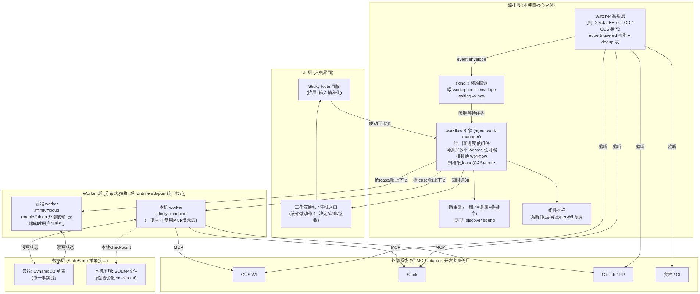
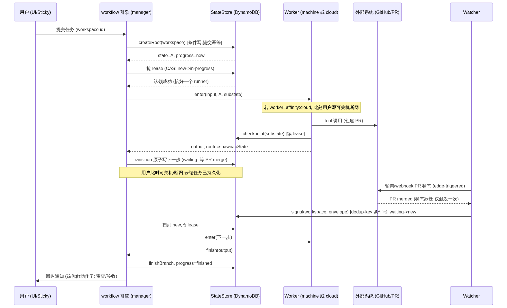
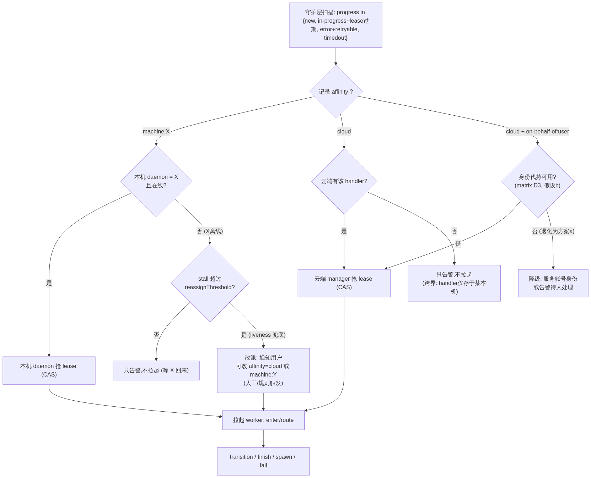
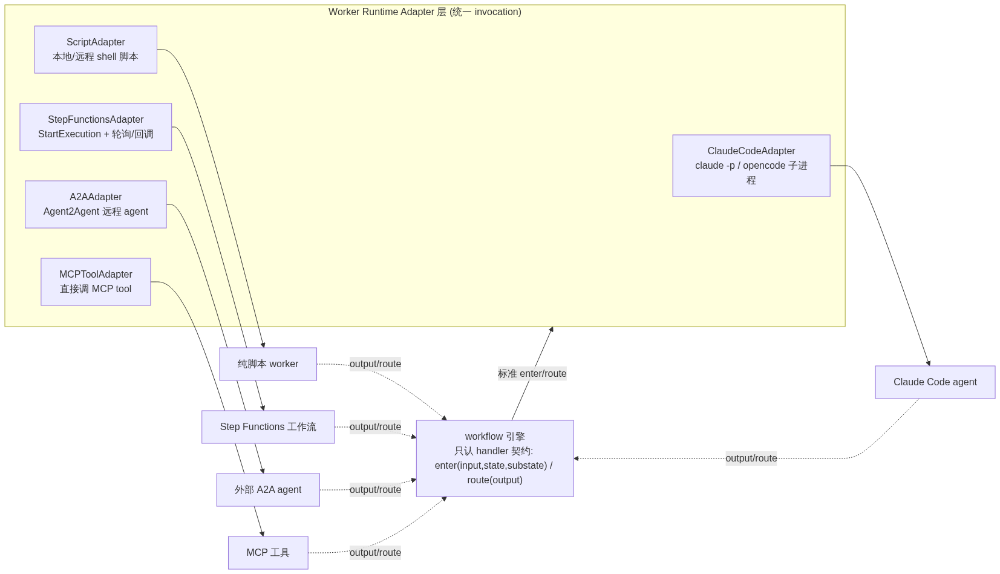
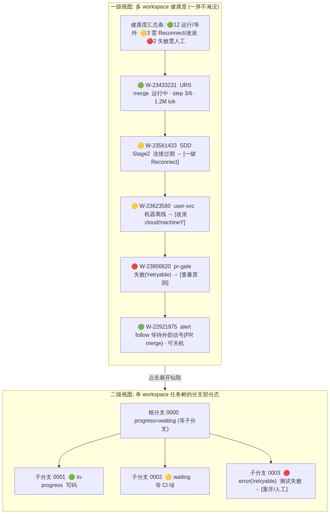

# 分布式 AI Agent 编排系统 — 技术设计文档

> 本文是**技术设计文档**，覆盖系统结构、各部分功能的选型与实现，主要面向**技术审核人**。
> 与之配套的**可行性报告**（现状、痛点、分期、功能、益处、前景，面向产品审核与领导层）见
> [`distributed-orchestrator-project-analyst.md`](./distributed-orchestrator-project-analyst.md)。两文交叉引用、内容互补。
> 底层状态机 / 持久化 / 幂等 / 恢复算法的完整设计见 `工作流模版.md`。

---

## 术语表（Glossary）

先钉死术语以免全文漂移；本版据 human comment 补充 **CAS / workspace / envelope**，并把 `agent-work-manager` 正式定位为 **workflow 引擎**。

| 术语 | 含义 |
|---|---|
| **Worker** | 被编排的**可执行单元**，形态无关：LLM agent / skill / command / Step Functions / 纯脚本皆可，只要遵循 handler 契约。 |
| **handler** | 状态机里的纯函数角色 / 数据模型字段（`enter` + `route`）。实体叫 Worker，字段/角色叫 handler。 |
| **workflow 引擎（manager）** | 唯一懂"进度"的组件（既有代号 `agent-work-manager`）：扫描未完成任务、抢 lease、喂上下文、收 output、推进状态。**一个 workflow 可以编排多个 worker，也可以把其它 workflow 作为子节点嵌套编排**（workflow 可组合）。 |
| **workspace（工作区）** | 面向使用者的**任务空间**抽象，是 `workid` + `branchId` 任务树的对外泛化名。一个 workspace = 一棵任务树（根分支 `0000` + 若干 fan-out 子分支）。内部仍以 `workid`（树唯一标识 + 提交幂等键）与 `branchId`（分支）落库。 |
| **envelope** | 统一事件信封：Watcher fire 出的事件、`signal()` 投递的载荷都用同一 schema，跨本机 push / 云端 SQS 一致。 |
| **CAS** | **Compare-And-Swap（比较并交换）**，一种乐观锁原语：仅当字段仍等于读到的旧值时才写入成功，用于保证"同一分支同一时刻恰好一个 runner"。DynamoDB 的条件写（`ConditionExpression`）即 CAS。 |
| **lease** | 基于 CAS 的租约锁，带过期时间；过期后可被其它 runner 回收。 |
| **substate / progress** | worker 自定义的状态内 checkpoint / 系统的生命周期枚举（`new/waiting/in-progress/finished/error/timedout`）。 |
| **affinity** | 运行位置亲和：`cloud` \| `machine:<id>`，决定由云端 manager 还是本机 daemon 认领。 |
| **submitter** | 任务提交者，既是检索键也是隔离边界（per-submitter 访问隔离）。 |
| **Watcher** | 信号采集单元（Slack / PR / CI-CD / GUS 状态等），边缘触发去重，把事件喂给编排器。 |
| **StateStore** | 状态持久化抽象接口：云端实现 = DynamoDB，本机实现 = SQLite/文件。 |
| **matrix / falcon** | 公司内部云端托管平台（外部依赖，非本项目交付）。 |
| **MCP adaptor / Suite Manager** | 在本机维护每连接鉴权的组件，一期鉴权复用它。 |

---

## 1. 一期架构

### 1a. 架构图与组件职责

一期系统分五层：UI 层、编排层（**本项目核心交付**）、Worker 层、数据层、外部系统。核心命题是「**workflow 引擎是唯一懂进度的组件，worker 是可被随时拉起的纯函数**」——这条约束是幂等与断点续跑得以成立的支点。

**一期落地形态 = 本机安装的开发者工具 + 简易 installer（回应 human comment）**：一期主要落地在**个人电脑本地**，作为研发效率提升工具。为降低门槛，一期交付一个**简易 installer**——一键安装本工具的依赖（UI 面板 + 编排层全部脚本 + 本机 StateStore/SQLite + watcher/job-scheduler），并**引导用户完成配置**（MCP 连接检查、输入源选择、云表凭据、affinity 默认值）。这把「攒工具链」的高门槛（PP5）降为「跑一个安装脚本」，是一期能被团队多人复现的前提。

**关键成本洞察 — token 只在 worker 层产生（回应 human comment，贯穿本表）**：五层中**只有 Worker 层是 LLM/token 的实际消费主力**；UI 层与编排层的 watcher/signal/路由器都是**确定逻辑、纯程序/纯脚本实现，不消耗 token**；编排层 workflow 引擎唯一的 AI 介入是「读上下文、拉起 worker」，token 消耗极小、可用**便宜的 Sonnet 档甚至规则**实现。这条洞察直接支撑 [project-analyst §3a](./distributed-orchestrator-project-analyst.md#3a-一期重点面向内部-engineer) 的 token 账单测算——**优化 token 成本 = 优化 worker 层的模型选择与步数，与编排层无关**。



> 源文件：`diagrams/v2-architecture.mmd`（可重渲染）。相较 V1：Watcher 采集层显式加了**监听 GUS 状态**的连线；`agent-work-manager` 改称 **workflow 引擎**并标注"可编排多 worker / 可嵌套 workflow"；编排层新增**韧性护栏**（熔断/限流/背压/预算）节点；云端 worker 标注"云端跑时用户可关机"。

| 层 / 组件 | 职责 | 一期交付边界 |
|---|---|---|
| **UI 层 — Sticky-Note 面板** | 人机界面：拉取输入（当前是 GUS WI）、驱动工作流、及时通知工作流状态与待办/待审批。基于现有 `tcm-toolkit/sticky-note` 扩展。**确定逻辑、纯程序实现，不消耗 token。** | 一期做「输入抽象化」——**提供输入源接口**：部分输入源允许使用者配置（选 GUS/Jira/…），同时提供**输入源开发接口**供后续扩展或用户二次开发（回应 human comment）；图形化流程编辑锁远期。 |
| **UI 层 — 工作流通知 / 审批入口** | workflow 引擎回叫的落点：告诉用户"**该你做动作了**"——即需要**人做决定、审查、签收（承担责任）**。**确定逻辑、纯程序实现，不消耗 token。** | 一期做通知 + 审批点 + 见 §2.6 的部分失败呈现与一键 Reconnect；**图形化拖拽编辑、富交互面板**（多面板联动、拖拽改状态机、可视化审计钻取）明确留后续。 |
| **编排层 — workflow 引擎（agent-work-manager）** | **唯一懂进度**。主循环：扫描未完成任务 → 用 **CAS（Compare-And-Swap）抢 lease** → 读上下文 → 拉起 worker → 收 output 跑 route → 原子写下一步。守护职责：把卡住的任务重新变成可认领（重置 lease / bump attemptCount / 改 progress），业务逻辑永远由 worker 跑。**一个 workflow 可编排多个 worker，也可把其它 workflow 作为子节点嵌套**。**本层唯一 AI 介入是「读上下文、拉起 worker」，token 消耗极小——可用便宜的 Sonnet 档甚至规则实现（回应 human comment）。** | **一期核心自研。** 云端引擎认领 `affinity=cloud`，本机 daemon 认领 `affinity=machine:自己`。 |
| **编排层 — 路由器（Router）** | 把"用户想要的功能"映射到具体 handler。**一期确定逻辑、纯脚本实现，不消耗 token。** | **一期降级为注册表 + 显式路由 + 关键字匹配**；「discover agent 自主语义找 handler」是开放研究问题，锁远期（远期语义路由才引入 LLM）。 |
| **编排层 — Watcher 采集层** | 监听外部信号源，**边缘触发（edge-triggered）去重**——仅状态跃迁时 fire。`watch-pr` 为参考实现，一期泛化为通用 Watcher 契约。**有 webhook 的源（GitHub/Slack）优先 webhook/事件推送，仅无 webhook 的源退回轮询**（回应 tech reviewer）。**纯脚本实现的钩子，不消耗 token（回应 human comment）。** | 一期覆盖若干预定义 watcher，例如**监听 Slack message、PR 状态、CI/CD 状态、GUS 状态**等；watcher 注册中心留后续。 |
| **编排层 — signal() 标准回调** | Watcher 不直接拉 worker，而是把统一 **envelope** 通过 `signal(workspace, envelope)` 喂给编排器（内部落到具体 `workid`/`branchId`），把 `waiting → new`，由引擎下一轮自然拉起。**投递以 dedup-key 做条件写保证幂等**（见 §2.2）。**纯脚本实现的钩子，不消耗 token。** | 一期定死 envelope schema + `signal()` 契约 + dedup 表。 |
| **编排层 — 韧性护栏** | 熔断 / 限流 / 背压 / bulkhead / per-workspace 预算，防止 fan-out 的 LLM 调用在下游故障时烧 token 放大故障。**纯脚本 + 条件写实现，不消耗 token。** | **本版新增，见 §2.1。** |
| **Worker 层 — 本机 worker** | `affinity=machine`，复用本机 MCP 登录态、以开发者本人身份调外部系统。**一期全自动脱机的主力。这里是实际工作的 AI 组件，是 token 的实际消费主力（回应 human comment）——成本优化的焦点全在此层（模型选择/步数/prompt caching），见 project-analyst §3a。** | 一期主力。 |
| **Worker 层 — 云端 worker** | `affinity=cloud`，跑在 `matrix`/`falcon`。**worker 在云端跑时，用户即可关机断网**（这正是"异步/脱机驱动"的核心价值）。以用户身份操作外部系统取决于 matrix 身份机制（OQ-2）。**同为 AI 组件，token 消费主力。** | 能力边界随外部依赖，标注风险。 |
| **数据层 — StateStore 抽象接口** | 状态持久化。**云端实现 = DynamoDB 单表（单一事实源）**；本机实现 = SQLite/文件（仅作性能优化 checkpoint，非事实源）。同一接口两种实现，让"本机/云端统一编排"真正成立。 | 一期做 DynamoDB 实现 + StateStore 接口；本机 SQLite 为可选优化。 |
| **外部系统（经 MCP adaptor）** | GUS WI / Slack / GitHub-PR / 文档-CI，均以**开发者身份**经 MCP adaptor 访问。 | 一期复用 MCP，不自建鉴权（D2）。 |

**为什么这样分层**：worker 的正确性、tool 幂等、语义判断下推给 worker；持久化、幂等状态转移、并发互斥、重试、审计由编排层保证（承诺边界见 `工作流模版.md` §1）。这条"机制/声明分离"让新 worker 的开发者只需声明状态机，不必重造持久化——这是**降低开发门槛**与**后续 SDK**的地基。

### 1b. 消息通讯时序图

下图展示一个典型 WI 全自动推进的时序：提交 → 幂等建根 → CAS 认领 → worker 执行并 checkpoint → 转移进入 `waiting`（等 PR merge）→ **用户此时可关机/断网** → Watcher 边缘触发捕获 PR merge → `signal()` 唤醒 → 引擎续跑 → 完成回叫通知。这条时序正是"**中断容错**"（D1）落地的证据链：单一事实源在云端，任何一步崩溃都能从最后 checkpoint 续跑，无需人从头重来。



> 源文件：`diagrams/v2-message-seq.mmd`。相较 V1：新增 note「若 worker=affinity:cloud，此刻用户即可关机断网」；`signal()` 标注 dedup-key 条件写；回叫通知措辞改为"该你做动作了（审查/签收）"。

**信号层的核心洞察（决策 D4）**：`watch-pr` 已隐含一套完整的信号 watcher 契约。一期将其泛化为通用 **Watcher 五要素契约**，而非每种信号各写一套：

| 要素 | watch-pr 体现 | 泛化概念 |
|---|---|---|
| 源 + 订阅 | PR url + watch-items | `source` + `event-types` |
| 轮询/推送调度 | crons + job-scheduler（登录态长驻） | 统一调度（webhook 优先，无 webhook 退回 poll） |
| **边缘触发** | 快照 diff，仅状态**跃迁**时 fire（merged 只触发一次） | **去重的本质 = edge-triggered，非 level** |
| 回调 | `callback` 命令 + 变量替换 | 信号如何投递（一期标准化为 `signal()`） |
| 生命周期 | create/watch/delete/list + expire + `job-id=hash(输入)` 幂等 | 注册/注销/自清理 |

**统一 event envelope（一期必做，独立于是否用 SQS）**：
```
{ source, event-type, subject-id (如 pr-url), dedup-key, payload, timestamp, target-workspace? }
```
无论本机回调 push 还是云端 SQS pull，fire 出的事件都用同一 schema——避免后续整合时全量返工。

**传输：一期本机回调 push，云端 waiting 唤醒按需 SQS**（D4）。`watch-pr` 现为回调 push（fire → 直接跑 callback，同步、点对点），本机 `affinity=machine` worker 已验证跑通、更简单；SQS（解耦、可持久、可重放）的真正价值在云端——`affinity=cloud` 的 `waiting` 任务靠"事件到达→唤醒"。后续再统一到事件总线。

### 1c. 数据存储的元数据结构与 DynamoDB 选型理由

单张 DynamoDB 表（云端实现），`PK = workid`，`SK = 层级 process-id`。整棵任务树（= 一个 workspace）共享同一 PK，`Query(PK)` 一次拉出全树。完整设计见 `工作流模版.md` §2；下表为报告读者摘录关键字段，并标注 D1/D2 新增字段。

| 字段 | 类型 | 归属 | 说明 |
|---|---|---|---|
| `workid` | PK | 系统 | 任务唯一标识，兼**提交幂等键**（同 workid 重复提交只建一次树，外部拿到 exactly-once）；workspace 的内部主键 |
| `processId` | SK | 系统 | `{branchId}#{stepIndex}`：分支命名空间 + 分支内步序，压进一个 key |
| `parentSk` | string | 系统 | 派生本分支的父步骤 SK（子任务血缘回溯） |
| `handler` | string | 系统 | 该记录由哪个 worker 处理 |
| `state` / `substate` | string | worker | 大阶段状态 / 状态内 checkpoint（JSON） |
| `progress` | enum | 系统 | `new/waiting/in-progress/finished/error/timedout`，引擎据此判断可否拉起 |
| `retryable` | bool | 系统/worker | 仅 `error` 时有意义：可重试 vs 终态（呼应 Saga 语义） |
| `input` / `output` | string | worker | 本步入参 / 产出（JSON），route 与审计读取 |
| `leaseOwner` / `leaseExpiry` | string / number | 系统 | 认领者 id / lease 过期戳，保证恰好一个 runner |
| `attemptCount` | number | 系统 | 已尝试次数，超阈值转终态 error |
| `tokenSpent` | number | 系统 | **本版新增**：本步/本树累计 token 消耗，用于 per-workspace 预算护栏（§2.1） |
| `stateFingerprint` | string | 系统 | state 名 + 状态图版本，恢复重放时校验，不匹配转终态告警（非确定性检测） |
| `createdAt` / `updatedAt` | number | 系统 | 创建 / 最后更新时间 |
| `affinity` | string | 系统 | `cloud` \| `machine:<id>`。守护层按 affinity 分区认领，跨界情形只告警不拉起（liveness 兜底见 §2.3） |
| `submitter` | string | 系统 | 检索键 + 隔离边界，共享云表须做 per-submitter 访问隔离（连回 D2 鉴权） |

**结构化 vs 非结构化**：系统字段为**结构化**；`substate` / `input` / `output` 为 worker 各自约定的**非结构化** JSON——满足"数据存储应包括结构化的约定部分 + 每个 worker 不同的非结构化部分"（设计思路·数据层）。状态存储 skill 屏蔽 PK/SK 拼接与序列化，worker 只管业务对象。

**为什么选 DynamoDB（结合主要用例，权衡 NoSQL）**（回应 human comment）：

主要用例决定访问模式，而访问模式决定选型：
1. **主循环高频点写 + 条件写抢锁**：引擎每步都是"读一条记录 → CAS 抢 lease → 原子写下一步"。DynamoDB 的**单项条件写（`ConditionExpression`）天然是 CAS**，单位毫秒级、水平扩展、无锁表，正是 lease/幂等的理想原语；关系库要用 `SELECT ... FOR UPDATE` 或版本列模拟，且在高并发点写下更易成为热点。
2. **按树整体读**：一个 workspace 的全部步骤共享 `PK=workid`，`Query(PK)` 一次拉全树——**item collection 内 SK 前缀检索**正是 DynamoDB 的强项，O(结果集) 且强一致可选。
3. **提交幂等 / exactly-once**：`workid` 做 PK + 条件写 `attribute_not_exists`，天然实现"同 workid 只建一次树"。
4. **公司既有栈**：TCM/URS 已在 DynamoDB 单表 + lease + outbox 上生产运行（7 实例、200 任务背压、1h Lock TTL），运维模式、告警、容量经验可直接复用。

**NoSQL 的功能缺失与权衡（诚实标注）**：
- **复合查询/多维过滤弱**：DynamoDB 无法像 SQL 那样任意 `WHERE a AND b ORDER BY c`。我们的缓解是**用 GSI 覆盖已知访问模式**：`GSI1 = submitter`（按提交者列任务，per-submitter 隔离）、`GSI2 = affinity + progress`（守护层分区扫描"可认领"任务）。这些是**有限、已知、可预先设计**的访问模式，正是单表设计擅长的；而"任意 ad-hoc 分析查询"我们**不在事务库里做**，导出到分析侧（审计轨迹 → 数据仓库）解决。
- **索引检索性能优势**：GSI 让上述关键查询保持 O(结果集)、可水平扩展，避免全表扫描；这是相对关系库在**已知模式 + 高吞吐**场景的净优势。
- **结论**：主要用例是"高频点写 + CAS 抢锁 + 按树读 + 幂等提交 + 少量已知维度列举"，与 DynamoDB 强项完全吻合；复合查询缺失通过 GSI + 分析侧导出规避，代价可接受。若未来出现大量 ad-hoc 关系查询需求，再评估 Aurora/PG 作为分析副本（不动事务主库）。

**热分区风险与缓解（回应 tech reviewer V2 P0/P1，V1 遗留，本版新增）**：
超大任务树共享单一 `PK=workid`——`Query(PK)` 拉全树 + 主循环高频点写集中在单一 item collection，可能撞 **DynamoDB 单分区上限（~1000 WCU / 3000 RCU）**；大扇出 workspace 尤其危险。缓解：

1. **一期先设 workspace 步数 / 并发子分支上限**（如单树 ≤ 数百步、活跃子分支 ≤ 数十）——一个开发工作流的自然规模远低于此，上限主要防失控 fan-out（与 §2.1 token 预算护栏同源，一处超限即熔断）。
2. **二期若需超大树，引入分支级 PK 分片**：`PK = workid#<branchShard>`，把同一树的不同子分支散到多个分区键；"按树读"改为**按已知分支分片并行 Query 后合并**（分片数有限、可枚举）。代价是全树读从一次 Query 变成 N 次并行 Query，但换来写吞吐水平扩展。
3. **热点监控**：复用 TCM 的 DynamoDB 分区级 CloudWatch 告警，`ConsumedWCU` 逼近分区上限即告警，先靠上限兜底、再按需分片。参考 [DynamoDB write sharding 最佳实践](https://docs.aws.amazon.com/amazondynamodb/latest/developerguide/bp-partition-key-sharding.html)。

**GSI2 派生背压真值查询自身的热分区（V5，回应 tech reviewer V4 视角 2.1）**：
§2.1 的背压真值靠 `Query GSI2 where affinity=<pool> and progress=in-progress` 的 `Count` 派生——但 `affinity` 是**低基数** GSI 分区键（`cloud` / 少数 `machine:<id>`），意味着"所有 cloud 在飞任务"共享**同一 GSI item collection**：既是 Count 读的集中点，也是**每次 `progress` 状态转移都要维护一次 GSI 写**的集中点。这与上文主表 `PK=workid` 的热分区是**同构风险，只是搬到了 GSI 上**。文档提的"按 submitter 分片 Query"只降**读**量、不解 GSI 的**写**热点。缓解与主表同源：**一期步数/子分支上限同样约束 GSI2 写量**（一次状态转移一次 GSI 写，步数上限即写量上限）；**二期若上分支级 PK 分片，GSI2 的分区键也应加 `affinity#<shard>` 维度**分散写。参考 [DynamoDB GSI 最佳实践](https://docs.aws.amazon.com/amazondynamodb/latest/developerguide/bp-indexes-general.html)。

一期结论：**先用步数上限规避热分区**（简单、够内部试点用，主表与 GSI2 同受此约束），分片作为二期水平扩展手段标注。

### 1d. 选型调研（每个关键组件：≤5 候选 + 取舍）

> **调研纪律**：先调研开源社区与商业软件；能否完全满足需求、若不能需自研什么、若能则在**稳定性/扩展性/授权(License)** 上是否允许公司内部使用与商业化。

#### 组件 A：持久化执行 / 状态机内核（编排层的心脏）

| 候选 | ⭐/定位 | License | 能否满足 | 取舍结论 |
|---|---|---|---|---|
| **LangGraph** | ~39k，LLM agent 专用图/状态机 + checkpointer | MIT | 场景最贴近（thread_id/checkpoint_ns/subgraph ≈ workid/branchId/子分支）；**但无内置并发锁（"最后写赢"，官方承认）、无显式状态、副作用不去重** | 若可引第三方依赖，**优先直接用**（配 DynamoDB checkpointer）；否则**借鉴其 subgraph 命名空间模型** |
| **DBOS** | ~1.5k，DB 背书的 durable workflow（步骤级 memoization） | MIT | 恢复算法最贴近：`(workflow_uuid, function_id)` ≈ `(workid, processId)`；check-then-execute、workflow_uuid 即幂等键、function_name 非确定性检测均可采纳；**memoization 直接省 LLM token** | 若可引依赖且要 Postgres 背书，**优先直接用**；否则**借鉴 check-then-execute 恢复算法** |
| **Temporal** | ~22k，通用 durable execution 集群（event sourcing + replay） | MIT | 设计模式来源：workflow/activity 分离 ≈ route/enter；heartbeat=lease+checkpoint；signal/child ≈ waiting/spawn。**但重量级、需集群、event-sourcing 全量 replay 对 LLM 非确定性代价高且危险** | 已有集群则用托管；否则太重，仅**借鉴模式** |
| **Restate** | ~4k，轻量 durable execution（单二进制，无需外部 DB） | **BSL（商用须评估）** | durable handler + 内置持久化，比 Temporal 轻；**BSL 授权对内部使用一般可、对打包进商用产品须法务确认** | **候选之一**，但 BSL 是商业化的授权变量，须显式评估 |
| **Inngest** | ~3k，durable functions + 事件驱动 + 步骤 memoization | 混合（SDK Apache-2 / 平台源码可用许可） | step-level memoization + 事件驱动天然贴合我们"信号唤醒"模型；SDK 授权友好 | **候选之一**，尤其"事件驱动 + step 记忆"值得借鉴 |
| **Windmill** | ~11k，脚本/工作流平台 | **AGPL（商用授权风险，须显式标注）** | 通用工作流 + 脚本执行 | **不优先**：AGPL 对商业化产品是硬约束，仅作参考 |
| **自研本模版**（`工作流模版.md`） | 轻量，DynamoDB 单表 | 自有 | 完全满足；显式 progress + lease+CAS + 分层 SK + 步骤级 memoization | **一期候选**，见下结论与工作量估计 |

**"自研"到底指什么？工作量估计（回应 human comment）**：

"自研"**不是从零重写一个 durable-execution 引擎**，而是分两档，取决于 OQ-1（合规能否引 MIT 依赖）：
- **档位 1（首选，若可引依赖）**：**在 LangGraph / DBOS 之上增加功能**——直接复用其 checkpointer/恢复算法，我们只写①DynamoDB StateStore 适配、②affinity 分区调度、③Watcher/signal 采集层、④韧性护栏。**这不是重写内核，是"集成 + 补我们独有的分布式/信号/护栏层"**。AI 辅助开发下，估 **6–10 人周**（1–2 名工程师）到可 dogfood 的 MVP。
  > **档位 1 的隐藏集成风险（回应 tech reviewer V2 P1，须注记）**：LangGraph 官方承认其 checkpointer 是**"最后写赢、无并发锁、副作用不去重"**（[LangGraph persistence](https://langchain-ai.github.io/langgraph/concepts/persistence/)）。我们要在其上叠加 **lease+CAS「恰好一个 runner」**语义——这**不是"复用 checkpointer"那么轻**：LangGraph 的 pending-write 并发模型与我们的 CAS lease 是**两套并发模型，可能语义打架**（谁是状态真相、pending write 如何与 CAS 抢锁协调）。因此**档位 1 的 6–10 人周若含"驯服 LangGraph 并发模型"，估计偏乐观**，须留缓冲或只借鉴其 subgraph 命名空间模型而非直接复用其 saver。此外 **DBOS 走 Postgres 背书，与公司既有栈（DynamoDB）冲突**——档位 1 若选 DBOS 需评估引入 Postgres 的运维代价（[dbos-transact-py](https://github.com/dbos-inc/dbos-transact-py)）。综合看，档位 1 更可能落在"借鉴 LangGraph 命名空间 + 自研 CAS lease 层"，而非无缝复用 saver。
- **档位 2（若合规禁止引依赖，全部自研内核）**：内核指状态机执行 + 幂等状态转移 + lease/CAS + 恢复重放 + 非确定性检测。**注意：这套算法 `工作流模版.md` 已设计完毕，且我们不追求 Temporal 级的通用性**（不做全量 event-sourcing replay，只做 checkpoint 续跑）。AI 辅助开发下，估内核 **8–14 人周**，加采集/护栏/调度共 **14–22 人周**。**风险诚实标注**：durable-execution 的 correctness 长尾（并发竞态、恢复边界、重放安全）是 Temporal/DBOS 花数年打磨的领域，自研档位的隐藏成本主要在测试与边界加固，故上限留了较大缓冲。

> 详细人月/里程碑/成本见可行性报告 [`project-analyst §3a 成本量化`](./distributed-orchestrator-project-analyst.md#3a-一期重点面向内部-engineer)。

**结论（组件 A）**：一期**优先档位 1（在 LangGraph/DBOS 上增功能）**，仅当合规禁止时退档位 2（自研内核，技术已备好）。无论哪档，**我们独有的价值层（affinity 分布式调度 + Watcher/signal 采集 + 韧性护栏 + StateStore 抽象）都要自研**——这才是差异化，而非重造持久化轮子。稳定性/扩展性：DynamoDB 单表 + lease CAS 已在 TCM 生产验证。授权：自有代码无障碍；LangGraph/DBOS(MIT) 可商用；**Restate(BSL)、Windmill(AGPL) 若入选须法务评估**。

> **OQ-1（最高优先，见 project-analyst §5）**：合规是否允许引入 MIT 的 LangGraph/DBOS？决定走档位 1 还是档位 2——一期成本与 token 账单的最大单点变量。已列为**立项前置阻塞项**，须指定 owner + deadline 向法务/架构确认。

#### 组件 B：云端 7×24 托管（"在哪跑"）

| 候选 | 定位 | 取舍结论 |
|---|---|---|
| **matrix（codeai/matrix）/ falcon**（公司内部） | 痛点 1 的既定解法，公司内部 agent 运行平台 | **一期依赖它**跑 `affinity=cloud` worker。**外部依赖，非本项目交付**——若未按期落地或能力不匹配，云端 24×7 能力标为排期风险，主力回退本机 worker（D3、痛点 1）。**下方专门调研 Matrix 的能力与缺口。** |
| **AWS ECS/Fargate + EventBridge Scheduler** | 通用容器托管 + 定时触发 | matrix 未就绪时的**技术退路**（自建最小托管），重复造轮子，非优选 |
| **GitHub Actions（self-hosted runner）** | CI 化的定时/事件触发 | 轻量场景可用（尤其 PR/CI 类 worker），非通用 agent 运行时 |

**Matrix（codeai/matrix）专项调研（V5，回应 PR human comment「调研 matrix 的成熟度/鉴权/能否跑云端 worker/能否做状态持久化」）**：

> **调研来源与置信度声明（诚实标注）**：本轮内部检索时 **codesearch（git.soma）与企业搜索（Confluence/glossaryhub）不可用**，无法直读 `codeai/matrix` 仓库与 `git.soma.salesforce.com/pages/codeai/matrix/docs/intro`（后者在 SAML 墙后）。以下依据作者此前**基于对 codeai/matrix 仓库源码级审阅**写就的对比分析（Google Doc《Claude-Tenant vs. Matrix: A Comparative Analysis》），属**二手（经作者本人源码审阅）**、未在本轮对仓库重新核验——故各条标注置信度，实施前须由 Matrix 团队一手确认。

| 维度 | 调研发现 | 置信度 | 对本项目的含义 |
|---|---|---|---|
| **鉴权/身份模型** | 身份层是 **MAS（控制服务）为每次 agent/step/tool 签发的短时 ES256 JWT**（TTL 1h、上限 4h、`jti` 防重放）；**签名私钥不出 Falcon KMS，签名由每个 pod 的 SPIFFE 证书授权**；暴露标准 OIDC discovery。JWT 携带 `mas:caller` 三模式：`u2s`（人，带 email）/`s2s`（服务，SPIFFE，默认只读）/`internal`（cron/MEP）。 | 中-高 | Matrix 的**强身份故事是面向内部服务间（s2s）**，不是"headless agent 以用户身份认证到外部 SF org（如 GUS）"。 |
| **外部 org 鉴权（GUS/Google）** | **平台内未解决**——GitHub/GUS/搜索经 **MCP Gateway** 走 service-mesh 身份；Google 认证是公开缺口（源文档自身标注）。 | 中 | **直接命中 OQ-2**：Matrix 强在内部 s2s，我们要的"云端 worker 以开发者身份操作 GUS/Slack（代持，假设 (b)）"**Matrix 未证明支持**——这印证 OQ-2 必须向 Matrix 团队一手确认，不能假定代持可用。 |
| **成熟度 / 采用** | **已在生产**、org 级、有**专职内部平台团队**维护、RFC agent 目录"数以百计"、有治理/成熟度模型（on-call、eval、canary、RFC 准入闸门）。 | 中-高 | 明确的"**生产在用**"信号（非 alpha/beta）；但**未见正式"GA"标签**（仓库/wiki 本轮不可达，无法核验）。作为一期依赖，成熟度风险低于预期。 |
| **云端 worker 执行（vs 我们的 `claude -p` 7×24）** | 每个 agent 跑在 **Falcon 上的临时 K8s pod（Agent VPE / "shadow workspace"）**，overlay 文件系统克隆 repo，**跑完即销毁**（24h/1h 回收）；框架 Mastra.ai + Claude Agent SDK；编排引擎 **Temporal**；统一入口 `POST /triggers/v1/trigger`。 | 中-高 | 真正的 per-run 隔离，适合"触发即跑一次"；**但与"常驻长监听进程"相反**。 |
| **缺口（vs 24×7 `claude -p` watcher）** | ① **无真正调度器**：靠 **15 分钟心跳**匹配规则做"cron"，**最细粒度 15 分钟**——不适合亚 15 分钟或精确节拍；② **临时 per-run pod** 与常驻 watcher 模型相反，"持续跑并响应"须建模为触发驱动的多次 run；③ **HITL 信任边界更宽**（直接从 Slack Block Kit 按钮触发 workflow）；④ **外部 org 鉴权未证明**（委托给 MCP Gateway）。 | 中 | 我们的 Watcher/常驻监听模型与 Matrix 的触发驱动 per-run 模型需**适配层**：把常驻 watch 建模为 Matrix 的"触发规则 + 多次 run"，或**本机 daemon 保留常驻监听、只把 worker 执行 offload 到 Matrix**。15 分钟调度粒度对 PR/CI 类边缘触发多数够用，精确节拍类留本机。 |
| **状态持久化** | 生产用 **Temporal** 做 durable workflow 状态/编排；Falcon/Terraform + Flyway 管声明式 trigger/config。 | 中 | **未见"agent session checkpoint 数据存储"的显式描述**（除 Temporal 的 durable execution）——"durable agent-session checkpointing"**未充分文档化**，是须向 Matrix 团队确认的缺口。这也意味着**我们的 StateStore（DynamoDB 单表）与 Matrix 的 Temporal 是两套持久化**：一期我们仍以自有 StateStore 为单一事实源，Matrix 仅作 worker 执行位置，不依赖其内部状态模型。 |

**结论（组件 B，V5 更新）**：一期仍绑定 `matrix` 作为 `affinity=cloud` worker 的执行位置，但调研澄清了三条关键边界——(1) **鉴权**：Matrix 的强身份是内部 s2s，**外部 org（GUS）代持未证明**，直接抬高 OQ-2 的确认优先级；(2) **执行模型**：Matrix 是临时 per-run pod + 15 分钟调度，与我们的常驻 watcher 模型不同，需"常驻监听留本机 / worker 执行 offload 到 Matrix"的适配；(3) **持久化**：Matrix 用 Temporal，我们仍以自有 StateStore 为单一事实源、不依赖 Matrix 内部状态。成熟度上 Matrix 是"生产在用"（风险低）。这些边界共同支撑一期"**本机 worker 为主力、云端 Matrix 为增强而非前置依赖**"的稳健定位，并把 OQ-2 从"待确认"升级为"有明确疑点待确认"。

#### 组件 C：鉴权（"以谁的身份调外部系统"）

| 候选 | 定位 | 取舍结论 |
|---|---|---|
| **MCP adaptor / Suite Manager**（现状） | 机器本地 + 交互式登录 + 开发者本人身份 | **一期复用**（D2）。不自建鉴权体系 |
| **server-side OAuth token 保管 + 刷新（自建/代持）** | 云端代持用户身份 24×7 | **后续目标**：突破一期"云端 worker 拿不到用户身份"的限制。一期不做 |
| **Salesforce Identity / Connected Apps** | 平台级身份 | 商业化 / 与 SF 产品耦合时的长期方向（见 §3），一期不引入 |

**结论（组件 C）**：一期复用 MCP，带出三条硬边界（D2）：依赖 MCP 的 worker 打 `affinity=machine`；交互式登录 ≠ 无头长跑（OAuth 过期时"只告警不硬跑"，由人 Reconnect，见 §2.6）；MCP 只解决"以谁的身份调"，不解决"谁能看云表里谁的任务"——per-submitter 访问隔离仍须做。

#### 组件 D：信号 / 消息传递（Watcher 与传输）

| 候选 | 定位 | 取舍结论 |
|---|---|---|
| **watch-pr 泛化（自研 Watcher 契约）** | 已验证的边缘触发 watcher + job-scheduler 登录态长驻 | **一期采集层选此**（D4），泛化为通用契约；**有 webhook 的源优先 webhook** |
| **Benthos / Redpanda Connect** | 声明式连接器框架（source→transform→sink） | **借鉴/可选复用**：有 webhook 的源接入可省自写 watcher（回应 tech reviewer） |
| **AWS SQS (FIFO)** | 解耦、可持久、可重放的事件传输 | **云端 waiting 唤醒按需用**；TCM 已用 SQS FIFO，运维成熟。一期不全量上 |
| **AWS EventBridge** | 事件总线 + 规则路由 | 后续统一事件总线的候选，一期不引入 |
| **DynamoDB Streams** | 表变更驱动引擎扫描 | 引擎扫描"先轮询、量大再上 Streams"（`工作流模版.md` §7），一期轮询 |

**结论（组件 D）**：一期 = event envelope schema + Watcher 契约 + 预定义 watcher（Slack/PR/CI-CD/GUS 等）+ `signal()` 标准回调 + dedup 表 + 本机回调 push（云端按需 SQS）。稳定性/授权：SQS/EventBridge 为 AWS 托管商业服务，公司已在生产使用，商用无障碍。

### 1e. 云端 StateStore 的写入鉴权、Provision 路径与数据安全（V5，回应 PR human comment）

human comment 提出四个具体问题：**(1) 本机的编排层/worker 如何被授权写云端 DynamoDB？(2) 如何防止人直接删/改这些数据（数据安全）？(3) PCSK 是什么、Falcon「provision resource」vs ad-hoc vs 本地存储怎么选？(4) Matrix 是否支持云端存储？** 本节据内部调研逐条作答。

> **调研来源与置信度声明**：本轮 codesearch 与企业搜索不可用（无法读 glossaryhub 的 PCSK 词条正式定义）；以下依据 **Google Drive 内部一手文档**——《Login with PCSK》（Anastasia Bidne）、TCM 一则 **RCA 事故复盘**（含确切文件路径与命令）、作者自己的《The Always-On Agent Runtime》设计文档（含具名先例）。**PCSK 的机制**置信度高（多文档印证），但 **PCSK 的字面缩写展开未核实**（glossaryhub 不可达）——本文**不臆断其全称**，只描述其机制。

#### (1) 本机 → 云端 DynamoDB 的写入鉴权：分「人的身份」与「服务的身份」两条路径

关键区分：**一期主力是开发者本机手动/半自动启动 worker（人的身份），二期云端常驻是服务身份**——两条路径的鉴权机制不同，且都**不使用长期存储的 AWS 密钥**。

- **路径 A — 人的身份（一期本机 worker 写云表，主力）= PCSK（JIT AWS 访问）**：
  - **PCSK 是真实存在的内部机制，且正是本场景的答案**（置信度：机制高）。它是一套 **JIT（just-in-time）AWS 访问系统**，入口 `https://dashboard.prodga.aws.jit.sfdc.sh`。流程：**Yubikey 登录 → 对特定 AWS 账户提交访问申请 → 列表内审批人批准 → "Get Credentials"**。凭据三种交付方式：启动 AWS 控制台（GUI）、**Export 出短时 AWS CLI 环境凭据**贴进终端、或 IntelliJ AWS Toolkit。均为**短时、按账户、绑人身份**的凭据。
  - **这正是"已认证的内部人（非服务）从笔记本写 AWS（DynamoDB 等）"的合规路径**，与一期"开发者本机 worker 以本人云凭据直连云表"（决策 D1）完全对齐。
  - **PCSK 访问是时间盒的、需周期性重新申报**（旁证：TCM 有"31 天 PCSK prod 访问"表、Zeus PCSK/AWS 访问对账表）——意味着一期"本机长跑"依赖的云凭据会**定期过期**，与 §2.6「MCP OAuth 过期 → 只告警不硬跑、由人 Reconnect」是**同一类过期问题**，本设计统一按"过期即告警、由人续期"处理，不假定凭据永不过期。
- **路径 B — 服务的身份（二期云端常驻 worker 写云表）= IAM Role / 实例 Profile（无存储密钥）**：
  - 二期 `affinity=cloud` 常驻 worker 跑在 Falcon 上，写云表走 **Falcon 服务的 IAM Role / 实例 profile**——**无长期密钥**、由平台注入。GUS 侧的具名先例：`sales-growth-bot@gus.com` 服务账号跑在 Falcon 上、走 **JWT Bearer**、密钥存 Vault（置信度高，作者设计文档具名）。秘密走 **AWS Secrets Manager / Vault** 运行时注入。
  - 这条路径也是"云端 worker 以何种身份操作外部系统"的落点——与 OQ-2（Matrix 代持 vs 门禁）耦合：若 Matrix 只给门禁（假设 a），云端 worker 用服务账号身份；若给代持（假设 b），才可能以用户身份。

#### (2) 数据安全：防止人直接删/改（最小权限 + 防误删）

一期云表是编排的单一事实源，**误删 = 全量停摆**。内部有直接教训可citable：一则 TCM RCA——一次为清 lint 告警执行的 `falcon addons tidy --all` **误删了一张 tier-1 DynamoDB 表（`userManagementWorkArea`），造成 dev/perf/test/stage 全线 user-ops 故障**（置信度高，事故复盘含确切命令）。据此，一期数据安全约束：

1. **Terraform `lifecycle { prevent_destroy = true }` 加在 tier-1 资源上**（凡丢失即中断服务的资源）——直接吸收上述 RCA 的首要教训，防"一条 tidy 命令删库"。
2. **apply 前必须人工审阅 Terraform plan**：dev 可自动 apply，stage/prod 须人工判断步；**绝不 apply 可疑 plan**。
3. **最小权限、按 workload 分权**（作者设计文档原则）：report-poster 只有 Slack-write、triage agent 只有 GUS 读 + 有限写，**无任何 worker 拿到 blanket 访问**；对云表，worker 的 IAM 策略**只授予自己 submitter 分区的读写**，不授予 `DeleteTable`/全表 `DeleteItem` 等破坏性权限。
4. **审计可归因**：所有有副作用的操作走 **AWS-IAM 认证路径以便 CloudTrail 记录真实 principal**；写归因到 bot、对人的操作归因到人。表数据本身 append-only + 软删（`progress=archived` 而非物理 delete），物理删除权限收归运维专用角色。
5. **恢复代价已知**：误删表的恢复非平凡（手动 AWS 恢复会让 Terraform state 失配 `ResourceInUseException`，需 Spinnaker import pipeline 重新 import state）——故**重预防（prevent_destroy）轻恢复**。

#### (3) Provision 路径：Falcon addon（config-as-code）vs ad-hoc vs 本地存储

- **本地存储（一期 dev / 单机试点起步）**：StateStore 的本机实现 = SQLite/文件（§1a 数据层）。**零 provision、零鉴权成本**，适合单人 dogfood 起步与本机 checkpoint。但**非多机/云端共享的事实源**。
- **Falcon addon（推荐的云端轻量路径）**：DynamoDB 表声明为 **Falcon "addon"**——`falcon/addons/*.tf` 里的一个 Terraform 文件（先例：`falcon/addons/dynamodb-workarea.tf` 声明 `userManagementWorkArea`），经 **SFCI + Spinnaker provision pipeline** apply（置信度高，RCA 含确切路径）。这是"config-as-code 的轻量路径"：**加一个 addon `.tf` → 审阅 Terraform plan → pipeline apply**；表的写权限经**服务的 Falcon IAM role**下发，非存储密钥。
- **ad-hoc（不推荐）**：手工在 AWS 控制台建表/给权限——会与 Terraform state 脱钩、不可复现、审计弱，仅限一次性实验。
- **结论**：一期 **dev/单机用本地 SQLite 起步**（零成本验证），**云端共享事实源用 Falcon addon**（config-as-code + IAM role + prevent_destroy），**不走 ad-hoc**。这条选择同时满足写入鉴权（路径 A/B）与数据安全（第 (2) 节）。

#### (4) Matrix 是否支持云端存储？

据组件 B 调研：**Matrix 的持久化是 Temporal（durable workflow 状态）+ Falcon/Terraform 管声明式 config**，**未见面向 agent 的通用"云端数据存储"供第三方 worker 自由读写的显式能力**（置信度中，仓库本轮不可达）。含义：**我们不应假定 Matrix 提供我们要的 StateStore**——一期仍以**自有 DynamoDB 单表（经 Falcon addon provision）为单一事实源**，Matrix 只作 `affinity=cloud` worker 的**执行位置**，两套持久化解耦（呼应组件 B 结论）。若 Matrix 团队确认可复用其存储层，二期再评估收敛，但**不作为一期前置依赖**。

> **本节带出的 OQ 更新**：PCSK 凭据过期节奏（路径 A）、Matrix 外部 org 代持（路径 B / OQ-2）、Falcon addon 的 provision owner —— 均并入 project-analyst §5 的 OQ owner+deadline 跟踪；数据安全约束（prevent_destroy / 最小权限 / append-only 软删）落 `工作流模版.md` 持久化约束。

---

## 2. 机制正确性（回应 tech reviewer 的 P0/P1）

本节针对 tech-reviewer V1（6.7/10）指出的"机制真空"逐条补齐设计。

### 2.1 熔断 / 限流 / 背压 / bulkhead / per-workspace 预算（P0）

编排器会 fan-out 昂贵的 LLM 调用；当某外部系统（GUS/Slack/Pod/LLM API）故障时，若无护栏会**烧 token 空转并放大故障**——直接吸收 TCM「一个 Pod 故障拖垮所有 Pod（noisy neighbor）」的教训。一期护栏设计：

- **熔断（Circuit Breaker）**：按外部依赖（每个 MCP 连接 / LLM 端点 / 下游服务）维护熔断状态（closed/open/half-open）。连续失败超阈值→open，快速失败并把相关任务转 `error(retryable=true)` 挂起，避免持续打爆。参考 [resilience4j](https://github.com/resilience4j/resilience4j) 模式。
- **限流 / 退避**：对 LLM API 与外部系统按令牌桶限流；`error(retryable)` 用指数退避 + 抖动重试（复用 `attemptCount`）。
- **背压（Backpressure）**：沿用 TCM 的**队列容量 + 在飞任务上限**模式（URS 200 任务背压）——引擎在飞 `in-progress` 数超阈值时停止认领新 `new`，让积压可见而非雪崩。
- **Bulkhead（隔离）**：按 `submitter` / 按外部依赖分池，单一用户或单一故障依赖不能耗尽全局并发额度，隔离 noisy neighbor。
- **per-workspace 预算护栏（关键，防失控烧钱）**：新增 `tokenSpent` 字段 + 每 workspace 的 **token 上限 + attemptCount 上限**做硬约束，超限转终态 `error` 并回叫通知，而非无限循环。预算数字见 [project-analyst §3a 成本量化](./distributed-orchestrator-project-analyst.md#3a-一期重点面向内部-engineer)。

**护栏状态在多实例引擎下的共享（回应 tech reviewer V2 P0，本版新增）**：
§2.5 的引擎是**多实例无主**，而熔断/背压/令牌桶若各实例**本地持有**，则 N 个实例各自学习故障、各自放行，**在飞上限与熔断阈值会被实例数放大 N 倍失效**。本版明确护栏状态的**共享落盘**：

| 护栏状态 | 存放层 | 一致性维护 | 降低竞争 |
|---|---|---|---|
| **熔断状态**（per-dependency closed/open/half-open + 连续失败计数） | DynamoDB **共享护栏项**（`PK=GUARD#<dependency>`） | 条件写（CAS）更新计数与状态跃迁，接受额外写成本 | 按 dependency 分项，天然分散 |
| **在飞 in-progress 计数**（背压） | DynamoDB **共享计数项**（按 `submitter` 分片：`PK=INFLIGHT#<submitter>#<shard>`） | 认领任务时原子 `ADD +1`、完成/失败时 `ADD -1`；读聚合分片求和判阈值 | **按 submitter + shard 分片**降低单项写热点 |
| **令牌桶配额**（限流） | DynamoDB 共享桶项（per-dependency） | 原子递减 + 定时回填（或用时间戳惰性补桶） | 按 dependency 分项 |

- **代价与取舍（量化，回应 product reviewer engineering P-B）**：共享落盘让护栏在分布式下**真正生效**（不被实例数放大失效），代价是每次认领/放行多一次条件写。**成本量化**：每步认领新增 **1 次条件写 + 1 次原子 ADD**（约 2 个 WCU/步）；以 project-analyst §3a 一期试点 15–25 workspace × 30–80 步估算，护栏额外写 ≈ **数千–低万次 WCU/月**，DynamoDB on-demand 写 ≈ $1.25/百万写请求 → **月增量成本 < $1，可忽略**（相对 token 账单是零头）。**延迟量化**：DynamoDB 单项条件写 p50 ≈ 个位数毫秒、p99 ≈ 10–20ms（同区域），叠加在本就存在的主循环点写上——即**每步 +个位数毫秒量级，对数小时的 worker 步不可感知**。这条增量已并入 project-analyst §3a 云资源月成本（明确标注「含护栏共享写」）。**按 submitter/dependency 分片**把额外写分散，避免自身成为热点。
- **`GUARD#<dep>` 故障风暴写热点（回应 tech reviewer V3 视角 3.2）**：熔断计数按 dependency 分项天然分散，但**同一 dependency 的高频故障计数仍集中在单一 PK**——故障风暴（大量任务同时撞同一下游故障）下 `GUARD#<dep>` 的连续失败计数 CAS 会成为瞬时写热点。缓解：对 `GUARD#<dep>` 再按**时间桶 + 实例分片**写（`GUARD#<dep>#<epochMinute>#<instanceShard>`）、读时聚合，把单点 CAS 打散；故障态短暂（cooldown 内即转 half-open），可接受。借鉴 [resilience4j](https://github.com/resilience4j/resilience4j) 的滑动窗口计数（其本身是单 JVM 内存态，分布式共享须自行落盘——本设计已如此）。
- **half-open 重探测挂到守护层重扫周期（回应 tech V2 残留）**：熔断 `open` 时把相关任务转 `error(retryable=true)` 挂起；守护层**每个重扫周期**检查 `open` 状态的 dependency，到 `cooldown` 后置 `half-open` 并**只放行一个探测任务**——探测成功→`closed` 恢复放行，失败→回 `open` 重新计时。即"下游长期故障的任务靠守护层重扫周期驱动 half-open 重探测"，不依赖额外定时器。
- **退路**：若共享计数的写成本在压测中过高，退化为**每实例本地配额 = 全局配额 / 实例数**（牺牲精度换零共享写），作为一期简化选项标注。

**在飞计数的 crash-leak 回收（回应 tech reviewer V3 唯一新增工程缺口 P1，视角 2/3）**：
V3 的在飞计数「认领时 `ADD +1`、完成/失败时 `ADD -1`」有一个**三阶正确性缺口**——若 worker 在 `+1` 之后、`-1` 之前 **crash**（而 crash/关机正是本系统存在的理由），该 shard 的在飞计数会**只增不减泄漏**；多次 crash 后背压阈值被幽灵计数**永久虚高触发（假背压）**，拒绝认领健康任务。根因：**独立计数器不是从记录派生的真相，而是可独立漂移的旁路状态**——这与 CAS lease 有本质区别（lease 的正确性靠「记录存在性 + leaseExpiry」这个真相支撑，天然 crash-safe）。

> **V4 决策：弃用独立在飞计数器，改由守护层从 `GSI2(affinity+progress)` 直接 `Count` 活跃 `in-progress` 记录派生背压真值。** 真相从记录派生 → 天然 crash-safe（crash 的任务其 lease 会过期，被守护层重新计入/回收，计数自动收敛）。代价是一次 GSI `Count` 查询（`Select=COUNT`，不拉回记录体，成本 = 扫描到的记录数 × 0.5 RCU，可按 submitter 分片 Query 降量）。

- **实现**：背压判定改为「守护层周期性 `Query GSI2 where affinity=<pool> and progress=in-progress, Select=COUNT`，按 submitter 分片求和」，用该派生值与阈值比较，而非读独立计数器。
- **保留计数器的备选**：若压测显示 GSI Count 频率过高，可保留原子计数器**但叠加 lease 过期驱动的周期性 reconcile**（守护层重扫时用 GSI Count 重算 shard 真值、覆盖漂移的计数器）——把计数器降级为「缓存」、GSI Count 为「事实源」。一期默认走前者（派生真值，无缓存一致性负担）。参考 [DynamoDB atomic counters 的已知局限](https://docs.aws.amazon.com/amazondynamodb/latest/developerguide/WorkingWithItems.html#WorkingWithItems.AtomicCounters)（非幂等、crash 下不可回滚）。

**背压是软上限、非硬保证（显式标注，回应 tech reviewer V3 视角 2/3；V5 补论证闭环，回应 tech reviewer V4 视角 2.2）**：无论派生 Count 还是分片计数，多实例并发认领下背压阈值判定都是**最终一致读**，存在窗口误差——可能瞬时略超上限后收敛。**一期明确把背压定位为「软上限」（防雪崩的软阀门），而非精确闸门**；需要硬上限的地方（如 per-workspace token 预算）用**单项记录上的 CAS 硬约束**（强一致），不依赖聚合计数。下游消费方不应把背压当精确闸门。

> **软上限不只是「选择」，而是 GSI 机制下的「必然」（V5 补，让软/硬约束分层论证完全闭环）**：DynamoDB **GSI 本就不支持强一致读**——派生 Count 天然滞后（GSI 传播延迟 + 守护层周期扫描间隔）。因此"背压必须是软上限"不是我们主观选的宽松策略，而是**从记录派生真值 + GSI 只读最终一致**这两条一叠加就无法回避的结论；反过来说，**任何需要强一致的硬上限（token 预算）就只能走单项记录的 CAS**（强一致条件写），不可能建立在聚合 Count 之上。软约束走 GSI 派生、硬约束走单项 CAS——这条分层由此完全闭环。

**GSI2 Count 扫描周期纳入压测调参（V5，回应 tech reviewer V4 视角 3.1）**：派生真值靠守护层"周期性 Count"——扫描间隔越长、背压反应越滞后（可能瞬时超上限更多）；越短、GSI 读成本越高。这是与 **lease TTL / 心跳间隔**同类的实现期调参项，一期不定死数字，**列入性能压测调参清单**：`{GSI2 Count 扫描周期, lease TTL, 心跳间隔, dedup 表 TTL}` 一并在试点压测中定频，用"背压新鲜度 vs GSI 读成本"的实测曲线选点。

### 2.2 signal 幂等 / 去重 + fan-out 重放防护（P0）

envelope 有 `dedup-key`，但 V1 没落地**在哪写、用什么条件写**。一期方案：

- **专用 dedup 存储**（DynamoDB item 或表）：`signal()` 投递时，以 `dedup-key`（= `source#event-type#subject-id#跃迁标识`）做**条件写 `attribute_not_exists`**；写成功才把 `waiting → new` 并入队下一步，写失败（已存在）则视为重复投递，直接丢弃。这把 exactly-once 落到一次 CAS。
- **crash 窗口（watcher fire 与 callback 之间）**：因 dedup-key 由事件内容确定（非随机），重放同一事件产生同一 key，条件写幂等吸收重放。
- **fan-out 双重 spawn 防护**：spawn 子分支时，子分支 `branchId` 由 **父步骤 SK + 确定性序号**派生（非随机），`createRoot`/`spawn` 用 `attribute_not_exists` 条件写——同一父步骤重放只建一次子分支。参考 DBOS check-then-execute（[dbos-transact-py](https://github.com/dbos-inc/dbos-transact-py)）。

**dedup 表 TTL vs 事件重放窗口的时序约束（回应 tech reviewer V2 P0/P1，本版新增）**：
dedup 存储只增不删会无限增长，需 TTL；但**TTL 若早于事件可能重放的最长窗口，会破坏幂等**（key 过期后同一重放事件被当新事件放行）。硬约束：

> **`dedup_TTL` 必须 > 事件的最长可能重放窗口 `max_replay_window`。**

- `max_replay_window` = watcher 崩溃恢复的最长间隔 + 传输层（SQS/回调重试）的最长重投窗口 + 时钟偏移余量。一期取**保守值（如 7 天）**，远大于 watcher 重扫周期（分钟级）与 SQS 消息保留（默认 4 天、可配 14 天）。
- dedup 项写入时带 `expireAt = now + dedup_TTL`，用 DynamoDB **原生 TTL** 自动清理，零运维。
- 结论：**只要 `dedup_TTL`（7d）> SQS 保留（≤14d 须相应调大）与 watcher 恢复窗口，幂等在重放下成立**；若二期把 SQS 保留调到 14 天，`dedup_TTL` 须同步 ≥ 14 天 + 余量。

**dedup 正确性串联依赖 watcher 快照持久化（回应 tech reviewer V2，本版新增）**：
edge-triggered 去重要求"同一跃迁产生同一 dedup-key"。但 dedup-key 含"跃迁标识"，而**跃迁标识依赖 watcher 的上次快照**——若 watcher 崩溃丢失快照，重建后可能对同一 merged 事件生成**不同**跃迁标识 → 绕过 dedup 重复 fire。因此 dedup 的正确性**串联依赖 watcher 快照的持久化**，这条依赖链本版显式画出并处理：

- **watcher 快照必须持久化**（一期落本机 SQLite/文件 + 云端 StateStore 备份），watcher 重启后**从持久化快照恢复**，而非从零重建 → 保证跃迁标识对同一跃迁稳定。
- **跃迁标识的确定性来源优先用事件自带的稳定标识**（如 PR 的 `merge_commit_sha`、GUS 的 `LastModifiedDate` + 状态值），而非 watcher 内部快照序号——这样即便快照丢失，从外部系统重查也能重建**同一** dedup-key，把对快照的依赖降到最低。
- 二者叠加：优先靠事件稳定标识（无状态可重建），快照持久化作为兜底 → dedup-key 跨 watcher 重启确定。

### 2.3 affinity 永久失配的改派（liveness，P0）

V1 的"`affinity=machine:X` 且 X 永久离线 → 只告警不拉起"会**永久卡死**。一期补 liveness 兜底（见更新后的调度图）：



> 源文件：`diagrams/v2-affinity-scheduling.mmd`。相较 V1：`machine:X` 离线新增 `stall > reassignThreshold` 判定→**改派**分支（通知用户，可改 `affinity=cloud` 或 `machine:Y`，人工/规则触发）。

- 任务在 `machine:X` 停滞超过 `reassignThreshold`（可配置，如 24h）→ 从"只告警"升级为**改派候选**：回叫通知 submitter，提供一键"改派到云端 / 改派到另一台在线机 / 保持等待"。
- **一期默认人工确认改派**（避免自动改派把只该在某机跑的 handler 误迁）；规则化自动改派留后续。
- **改派前校验目标端具备该 handler + 依赖（回应 tech reviewer V2 残留）**：`machine:X → cloud`（或 `→ machine:Y`）改派前，先查目标端的 **handler 注册表**与**鉴权可达性**——若目标端没有该 handler，或该 handler 依赖的 MCP 连接在目标端不存在（如本机专属登录态），则**改派选项置灰并说明原因**（"目标端缺 handler / 缺鉴权，无法改派"），避免"改派后仍拉不起"的空转。改派候选清单只列**目标端确实能跑**的位置。

### 2.4 异构 runtime adapter + MCP/A2A 定位（P1）

这是"编排 OS 层"命题成立的关键：云端引擎如何**统一地**拉起一个 Claude Code agent vs 纯脚本 vs Step Functions？答案是 **Worker Runtime Adapter 层**——引擎只认 handler 契约（`enter`/`route`），具体"怎么启动这个 runtime"由 adapter 封装。



> 源文件：`diagrams/v2-runtime-adapter.mmd`

| Adapter | 拉起方式 | 一期状态 |
|---|---|---|
| **ClaudeCodeAdapter** | `claude -p` / opencode 子进程，喂 prompt+input，收结构化 output | 一期主力（现有原型即此） |
| **ScriptAdapter** | 本地/远程 shell 脚本，约定 stdin/stdout envelope | 一期做 |
| **StepFunctionsAdapter** | `StartExecution` + 轮询/回调映射到 `waiting`/`finish` | 一期做粗粒度编排（沿用 TCM 50-op 阈值模式） |
| **A2AAdapter** | 通过 [A2A（Agent2Agent）](https://github.com/google/A2A) 协议调远程 agent | **后续**：预留契约，一期不实现 |
| **MCPToolAdapter** | 直接调 [MCP](https://modelcontextprotocol.io) tool | 一期做（worker 内部本就走 MCP） |

**adapter 契约级细节（从"能列出"升级到"能定契约"，回应 tech reviewer V2 P1）**：

一期主力两条路径给出**明确契约**，而非停在清单：

- **ClaudeCodeAdapter 的结构化 output 解析契约**：`claude -p` 子进程 stdout 会混入日志/思考/非结构化文本，可靠解析是现实难题。契约：
  1. **约定 sentinel 包裹 + per-call nonce 防复述（V4 强化，回应 tech reviewer V3 视角 4）**：prompt 中强约束 worker 把最终结构化结果输出在**固定哨兵之间**。V3 用静态哨兵 `<<<ORCH_OUTPUT_BEGIN>>>…<<<ORCH_OUTPUT_END>>>` 有对抗性长尾——worker 是 LLM，可能在思考文本里**复述哨兵字符串本身**（复述 prompt、生成示例）导致 adapter 误取。**V4 契约：每次调用注入一个随机 nonce，哨兵形如 `<<<ORCH_OUTPUT_BEGIN:{nonce}>>>{json}<<<ORCH_OUTPUT_END:{nonce}>>>`，adapter 只认本次注入的 nonce**；同时**取最后一对完整、nonce 匹配的哨兵**（防止前文复述污染）。这把 LLM 复述污染的概率降到可忽略。
  2. **优先用结构化输出模式**：能用 `--output-format json`（或工具的结构化输出能力）时**作为主路径**直接取，nonce 哨兵仅作兜底——结构化输出模式不受 stdout 文本污染，是最稳妥的路径。
  3. **解析失败 = 显式失败**：哨兵缺失/JSON 非法 → 该步转 `error(retryable=true)`（bump attemptCount 重试一次），连续失败转终态告警，**绝不把半解析结果当成功**。
  4. **进度回传**：子进程按 §2.6 约定周期性打印 `<<<ORCH_PROGRESS>>>{step,tokenSpent}` 行，adapter 转成 `checkpoint()` 续 lease + 更新 `tokenSpent`。
- **StepFunctionsAdapter 的执行态映射契约**：`StartExecution` 后，SFN 执行态 → 编排器 progress 映射——`RUNNING → in-progress`（轮询/EventBridge 续 lease）、`SUCCEEDED → finished`（取 output 跑 route）、`FAILED/TIMED_OUT/ABORTED → error`（`retryable` 由 SFN 错误类型判定：`States.Timeout`→retryable，业务错误→terminal）。沿用 TCM 50-op 阈值模式选粗/细粒度。

**与业界标准的定位（必答题）**：
- **MCP（Model Context Protocol）**：已是**工具互操作事实标准**。本编排器是 **MCP 的消费方**——worker 通过 MCP adaptor 调外部工具/系统；我们不重造工具协议，鉴权也复用它（组件 C）。MCP 未覆盖的鉴权类型（某些 service account / 自定义 token）在 adapter 层留"直连凭据"退路，不强绑 MCP。
- **A2A（Agent2Agent）**：agent 间互操作的新兴标准。本编排器定位为 **A2A 的编排上层**——把遵循 A2A 的远程 agent 当作一种 worker runtime（A2AAdapter）纳入编排，而非与 A2A 竞争。一期预留契约、不实现，避免过早绑定未定标准。

**跨大模型归一 = 二期已知边界（回应 tech reviewer V2 P1）**：一期只覆盖 Claude Code / opencode（同族 `claude -p` 语义），**不做**"同一 handler 在 Claude/GPT/Gemini 间的调用转换与 prompt/tool-schema 归一"。这是明确的**已知边界**——二期若要接异构大模型 worker，须在 adapter 层加一层"模型能力归一"（prompt 模板差异、tool-calling schema 差异、结构化输出能力差异）。一期标注为边界，不实现。

### 2.5 workflow 引擎自身 HA

云端引擎**多实例无主**：轮询模型允许任意实例扫描，认领靠 `affinity + progress` GSI + **CAS 抢 lease** 天然去重（同一分支恰好一个 runner）——因此**引擎非 SPOF**，挂掉任一实例其余继续扫描。本机 daemon 是单点，但只影响该机的 `machine:X` 任务，且由 liveness 改派（§2.3）兜底。

### 2.6 局部失败 / 高延迟的 UI 呈现（P1）

分布式 UX 最难的问题——"N 个任务中 2 个 waiting、1 个 error(retryable)、1 个 MCP 过期需 Reconnect"如何被可理解地呈现——一期从"断言"变"设计"：

**progress 枚举 → UI 状态映射**：

| progress / 情形 | UI 呈现 | 用户动作 |
|---|---|---|
| `new` / `in-progress` | "运行中"（转圈 + 当前步名 + 已耗时/已花 token） | 无（可看进度） |
| `waiting` | "等待外部信号"（等什么：PR merge / CI / 审批） | 无（可关机，云端 worker 继续） |
| `finished` | "完成，待签收" | **审查 + 签收（承担责任）** |
| `error(retryable)` | "重试中（第 N 次）" | 无（自动退避重试） |
| `error(!retryable)` / `timedout` | "失败，需人工" | 查看原因 / 重开 |
| **MCP OAuth 过期** | "连接已过期，需 Reconnect"（高亮） | **一键 Reconnect** |
| **machine:X 离线停摆** | "所在机器离线"（§2.3） | **一键改派 / 保持等待** |

- 一期显式交付**「多任务健康度 / 待办 / 需 Reconnect」面板**（sticky-note 扩展）：一屏看清所有 workspace 的 progress 分布，红点标出需人介入的两类最高频情形——**笔记本关机导致 machine worker 停摆** 与 **MCP OAuth 过期**——并把"stall/过期 → 通知 → 一键 Reconnect/改派"做成闭环。
- sticky-note 目前仅 macOS 桌面（一期内部可接受；商业化需跨端，见 project-analyst）。

**健康度面板线框 + fan-out 树形部分态（回应 tech reviewer V2 P1，本版新增）**：



> 源文件：`diagrams/v3-health-panel.mmd`。设计要点：
> - **一级视图（多 workspace 不淹没用户）**：顶部**健康度汇总条**（🟢 运行/等待 · 🟡 需 Reconnect/改派 · 🔴 失败需人工）先给总量；下方每行一个 workspace，用**颜色 + 一句话状态 + 就地动作按钮**（[一键 Reconnect]/[改派]/[查看原因]）。信息密度策略：**默认只展开非绿（🟡🔴）需人介入的**，绿色折叠计数——20 个并发也只需看少数需动作的。
> - **二级视图（钻取单 workspace 的任务树部分态）**：点开一个 workspace → 展示其**任务树的分支部分态**（根分支 + fan-out 子分支各自的 progress），解决"一棵树里 2 分支 waiting、1 分支 error"如何呈现——这正是分布式 UX 最难的层级。之前面板只停在 workspace 级聚合，本版补齐**树内分支级**钻取。
> - 一期实现为 sticky-note 的两级视图；线框为设计基线，视觉细节留实现。

---

## 3. 与 Salesforce 既有编排原语的关系（回应 tech P1 / product P1）

一份自称"编排底座"的报告必须正面回答：**为何不在 Salesforce 既有能力上构建，而另起一个 DynamoDB 引擎？**

| SF 既有能力 | 它解决什么 | 与本项目关系（互补 / 替代 / 桥接） |
|---|---|---|
| **Flow Orchestrator** | 平台内、声明式、含人工审批步骤的业务流程编排（面向 Admin/低代码，运行在 Platform 内） | **互补 + 桥接，不替代**。Flow Orchestrator 面向 Platform 内的业务对象与用户，**不为"7×24 无人值守、跨本机/云端、驱动任意 CLI agent（`claude -p`）、断点续跑数小时的开发者工作流"设计**——它没有 lease/affinity/token 预算/脱机续跑这套运行时语义。本项目做**Platform 外的 durable agent 运行时**；桥接方式：把一个编排 workspace 暴露为 Flow 可调用的 async 动作，或 Flow 审批步骤回调本编排器。参考 [Flow Orchestrator 文档](https://help.salesforce.com/s/articleView?id=sf.flow_concepts_orchestrator.htm)。 |
| **Platform Events** | 平台内事件总线（发布/订阅） | **桥接候选**：可作为 Watcher 的一个 source（订阅 Platform Event → envelope → signal），或本编排器把状态跃迁发布为 Platform Event 供 SF 侧消费。一期不实现，预留 envelope 兼容。 |
| **Agentforce orchestration** | 造 agent、agent 内的 reasoning/planner | **互补**：Agentforce 解决"造 agent"，本项目解决"让 agent 可靠长跑并被编排"。本编排器可作为 Agentforce Action 的长跑后端（见 project-analyst §2d、OQ-5）。 |

**AgentforceActionAdapter 契约 + 与非确定性 planner 的共存（V4，回应 product reviewer SF-architect V3 残留 #1/#3，收敛为 OQ-5）**：
V3 的 Agentforce 技术桥停在「Action 回调走 Platform Event 还是 notification」的"或"，且未回答一个更深的正确性问题——**编排器靠 stateFingerprint + checkpoint/replay 假设「同一步骤可安全重放得等价结果」，但 Agentforce planner 是非确定性推理，Agent session 本身不是可倒带的状态机**。V4 给出设计原则（一期不实现，作为 AgentforceActionAdapter 的契约草图 + OQ-5 待战略层裁决）：

- **把 Agentforce Action 当「至多一次触发、结果异步回调收敛」的黑盒**：编排器 `submit` 触发一个 Agentforce Action 后，**不把 Agent session 内部的推理纳入 replay 校验**——session 内部的非确定性推理由 Agentforce 自己负责，编排器只在其边界上做幂等（触发用 dedup-key 保证至多一次，结果通过异步回调收敛）。这样两套状态模型（我们的可倒带 checkpoint vs Agentforce 的不可倒带 session）在**边界解耦**，不互相污染。
- **回调统一走 Platform Event（建议结论，非"或"）**：Action 完成/超时的异步回调**统一走 Platform Event**——与本项目 Watcher/envelope 设计天然对齐（Platform Event 作 Watcher 源 → envelope → signal），避免 Agentforce notification 与 Platform Event 双通道。
- **`workid` ↔ Agentforce session 生命周期映射**：编排器 `workid`（长跑、可续跑）与 Agentforce session（对话态、可能短命）**不是一一对应**——一个 `workid` 可跨多次 Action 触发；映射关系维护为「`workid` → 最近一次触发的 session/execution id」，session 结束不等于 workid 结束。
  - **该映射本身是须持久化的 durable 态（V5，回应 tech reviewer V4 视角 4.1）**：这份 `workid↔session` 映射**本身就是状态**——若只存 adapter 进程内存，adapter 重启即丢失、回调回来找不到对应 workid。因此实现阶段**该映射必须落 StateStore（而非 adapter 内存态）**，作为 workid 记录上的一个字段或关联项持久化；跨多次 Action 触发时映射的更新走**单项 CAS**（与 lease 同款条件写）保证原子。**触发复用 dedup-key 保证至多一次**：Action 触发的 dedup-key = `workid#stepIndex#actionName`，触发前条件写 `attribute_not_exists`——重放同一步只触发一次 Action，映射更新与"至多一次触发"由同一把 CAS 锁串起。这与 §2.2 signal dedup 是同一套幂等原语，无需新机制。
- **stateFingerprint 扩展校验 Prompt 版本**：远期若接入 Prompt Builder，stateFingerprint 除校验「代码/状态图版本」外，应**同时校验 Prompt 模板版本**——解决"prompt 改了、code 没改"的隐性非确定性。
- 以上均列为 **OQ-5**（project-analyst §5），交 Agentforce 平台架构团队 + 本项目 owner 联合裁决，deadline 放闸门 B 前。

> **平台约束占位数字（回应 product reviewer 建议，与 token 账单「待核准」处理方式对称）**：三个桥接点各有平台侧硬约束，一期不实现、仅占位待核准——Platform Event 发布频率上限、Flow invocable action 同步执行时限、Agentforce Action 会话内超时。实现前须查 [Platform Events 限制](https://developer.salesforce.com/docs/atlas.en-us.platform_events.meta/platform_events/platform_events_intro.htm) 核准具体数字。

**Einstein Trust Layer（商业化硬门槛）**：一旦 LLM worker 操作**客户数据**，必过 [Einstein Trust Layer](https://www.salesforce.com/products/platform/trusted-ai/)（脱敏/审计/零留存/毒性检测）。一期只处理**公司内部研发数据（GUS/PR）**，不触客户数据，故一期不接；但**商业化/FDE 带客户场景前必须接入**——列为商业化前置门槛（见 project-analyst 风险登记）。

**Hyperforce 多租户 / 数据驻留**：共享云表当前仅由 `submitter` 做粗隔离，够一期内部用；走向 Platform/多租户商用时须满足 Hyperforce 的**租户隔离 + 数据驻留**合规——这是比 submitter 隔离更大的架构改造（可能需 per-tenant 表/账户 + 驻留区域路由），在 §4 与 project-analyst 远期架构显式点名。**对 StateStore 抽象的返工面（回应 tech reviewer V2）**：per-submitter → per-tenant 意味着 StateStore 接口需加 `tenantId` 维度（PK 前缀或独立表/账户 + 驻留路由），是 StateStore Provider 的一次扩展而非重写——因一期已把持久化收敛为接口（§4），返工集中在 Provider 实现层，抽象层可复用。

**Platform Event → signal 的租户上下文映射（回应 tech reviewer V2 P2）**：远期若订阅 Platform Event 作为 Watcher 源，事件的 `tenantId`/`OrgId` 须映射到编排器的隔离键——一期 `submitter`（个人身份）在多租户下升级为 `(tenantId, submitter)` 复合键，envelope 增 `tenantId` 字段透传，signal 落库时按复合键分区。一期不实现，预留 envelope 字段兼容。

**Data Cloud / Prompt Builder 集成方向草图（V4 补，回应 product reviewer SF-architect V3 残留 #2，远期方向性）**：
- **Data Cloud（zero-copy ingestion）**：编排器自产的 append-only 审计轨迹（每 workspace 的 progress/介入率/token/失败模式）是天然的产品分析数据源——远期作为 [Data Cloud zero-copy](https://help.salesforce.com/s/articleView?id=sf.c360_a_zero_copy_data_federation.htm) 的联邦数据源接入，与 project-analyst §2c「反馈闭环工具化」天然衔接，无需搬数据即可在 Data Cloud/Tableau 侧分析。
- **Prompt Builder**：远期 worker 的 prompt 若由 [Prompt Builder](https://help.salesforce.com/s/articleView?id=sf.prompt_builder_overview.htm) 托管，stateFingerprint 扩展为「代码版本 + 状态图版本 + Prompt 模板版本」三元组，把"prompt 悄悄改了"纳入非确定性检测。
- 一期均不实现；仅给方向，避免"底座候选"叙事在集成路径上完全空白。

---

## 4. 可外带 IP 内核边界（回应 product FDE P0）

FDE 把编排器带到客户现场时，需要替换的远不止一个 StateStore。明确"可标准化外带 IP"vs"内部专属、现场需重写"，并把鉴权/托管做成**可插拔 Provider**：

| 层 | 可外带 IP（标准化内核） | 内部专属（现场需重写 / 换 Provider） |
|---|---|---|
| 状态机语义 | ✅ handler 契约（enter/route）、progress 枚举、幂等/恢复算法、stateFingerprint | — |
| 事件 | ✅ event envelope schema、Watcher 五要素契约、signal()+dedup 语义 | ❌ 具体 watcher（GUS/Slack/PR 的连接细节） |
| 路由 | ✅ 注册表 + 路由契约 | — |
| 韧性 | ✅ 熔断/限流/背压/预算护栏框架 | — |
| **持久化** | ✅ StateStore 接口 | ❌ DynamoDB 实现（客户现场可能用其它 KV/DB → 换 StateStore Provider） |
| **鉴权** | ✅ 鉴权 Provider 接口 | ❌ MCP adaptor 实现（现场换 client OAuth / Connected Apps Provider） |
| **托管** | ✅ Runtime Adapter 接口（§2.4） | ❌ matrix/falcon 实现（现场换 ECS/自建 Provider） |
| 输入源 | ✅ 输入抽象接口 | ❌ GUS WI 实现（现场换 Jira/客户系统 Provider） |

**设计原则**：把"内部专属"三层（持久化 / 鉴权 / 托管 / 输入源）全部收敛到**接口 + 可插拔 Provider**，云端一套实现、客户现场另一套实现。参考同为"背景任务 + 人机闭环 + 可移植运行时"的开源分层：[Inngest](https://github.com/inngest/inngest)、[Trigger.dev](https://github.com/triggerdotdev/trigger.dev) 的 SDK/Provider 分层；worker↔引擎解耦参考 [Camunda Zeebe Job Worker](https://docs.camunda.io/docs/components/concepts/job-workers/) 模式。

**FDE 现场兼容性验证：从「干净 org 冒烟」升级为「dirty org 冒烟」（V4，回应 product FDE reviewer V3 残留 #1）**：
V3 的"干净/空 org 冒烟"被 product reviewer 正确指出是**更弱替代**——空 org 天然不含客户既有 Apex 触发器/Flow/自定义对象，恰恰**测不出编排器与客户既有自动化是否打架**（触发器递归、Flow 与 Watcher 事件顺序竞态、自定义对象命名冲突）。V4 把判据升级为：

> **二期 FDE 培训前，至少完成一次「dirty org 冒烟」**：用 Scratch Org + 预装一个**含自定义对象 / Flow / Apex 触发器的常见 AppExchange 包**做近似真实环境（成本远低于找真实客户 Org，但能暴露冲突面），跑通最小内核并产出兼容性结论。

- 该判据明确排入**二期 FDE 培训前** deadline（不再挂"未来问题"含糊处理），成本并入 project-analyst §3b 的二期 Provider 化预算。
- **打包/交付形态 + 现场支持模型（FDE 落地成本，二期随试点补充）**：一期 installer 面向本机开发者；FDE 现场部署整套栈（Docker / managed package / 安装脚本）与 Provider 层 bug 的 L2 支持/escalation 路径，列为**二期 FDE 试点须定义项**，避免账面 Provider 化人周低估真实落地成本。

**多租户复合键与分片键的交互（远期返工面，回应 tech reviewer V3 视角 6.2）**：走向 Platform 多租户时，§3 的隔离键 `submitter` 升级为 `(tenantId, submitter)` 复合键——这会与 §1c 热分区分片键（`workid#<branchShard>`）、§2.1 在飞/护栏分片键（`INFLIGHT#<submitter>#<shard>`、`GUARD#<dep>`）产生**交互**：多租户下这些分片键都需再纳入 `tenantId` 维度（如 `INFLIGHT#<tenantId>#<submitter>#<shard>`）。这是 StateStore Provider 的一次扩展（PK 前缀加维度），非抽象层重写；一期不展开，在此连一句边界，实现阶段随多租户改造一并处理。

---

## 附录 A：设计依据与决策追溯

- **D1**：本机 worker 恢复主体 = 本机 daemon；单一事实源 = 云端；`affinity`/`submitter` 字段；"断网"= 中断容错而非断网执行。
- **D2**：一期鉴权复用 MCP（开发者本人身份、机器本地）；三条硬边界。
- **D3**：matrix 云端 worker 身份机制（外部依赖 + OQ-2，工作假设 (b) 代持）。
- **D4**：消息/信号层 = watch-pr 泛化的 Watcher 契约 + event envelope + `signal()` 回调；一期本机 push、云端按需 SQS。
- **D5**：效率证据度量口径（诚实标注 n=1 + 试点验证路径）。
- 底层状态机/持久化/幂等/恢复算法：`工作流模版.md`（§1–§8，含 LangGraph/DBOS/Temporal prior-art 对照）。

## 附录 B：Open Questions（技术侧）

- **OQ-1（最高优先）**：合规能否引入 MIT 的 LangGraph/DBOS？决定组件 A 走档位 1（增功能）还是档位 2（自研内核）——一期成本与 token 账单最大变量。**立项前置阻塞项**，需 owner + deadline。
- **OQ-2（D3）**：`matrix` 的"本机个人鉴权 → 云端 worker"是 (a) 调用门禁还是 (b) 身份代持？决定 `affinity=cloud` worker 能否以用户身份操作外部系统。工作假设 (b)，待向 matrix 团队确认。
- **OQ-5（V4 新增，§3）**：Agentforce 技术桥的两个悬而未决点——(1) Action 异步回调机制（建议统一走 Platform Event）+ (2) `workid`↔Agentforce session 生命周期映射与「session 内非确定性推理不纳入 replay」黑盒契约。决定「可被 Agentforce 复用的编排底座候选内核」这一战略卖点的技术可行性。建议交 Agentforce 平台架构团队 + 本项目 owner 联合裁决，deadline 放闸门 B 前。

---

## 修订区（Changelog）

### V5 — 2026-08-12（回应 PR #4 新一批 human comment + tech reviewer V4 反馈）

**变更时间**：2026-08-12。**本文档（技术设计）相较 V4 的主要改进**：

1. **§1e 新增「云端 StateStore 写入鉴权、Provision 路径与数据安全」（回应 PR human comment：DynamoDB 本机写授权 / 数据安全 / PCSK / Falcon provision vs ad-hoc vs 本地存储 / Matrix 是否支持云端存储）**：据内部一手文档调研——(1) 写入鉴权分「人的身份 = **PCSK**（JIT AWS 短时凭据，Yubikey 登录 + 审批 + Export CLI 凭据，一期本机主力）」与「服务身份 = IAM Role/实例 profile 无存储密钥（二期云端，GUS 具名先例 `sales-growth-bot@gus.com`）」；(2) 数据安全据 TCM 误删 tier-1 表 RCA 得出 `prevent_destroy` + apply 前人工审阅 plan + 最小权限按 workload 分权 + append-only 软删 + CloudTrail 归因；(3) Provision 选 **Falcon addon（config-as-code）**，dev 用本地 SQLite 起步、不走 ad-hoc；(4) Matrix 持久化是 Temporal，不假定其提供通用云端存储，我们仍以自有 DynamoDB 为单一事实源。**附调研可用性/置信度声明**（codesearch/企业搜索本轮不可用，PCSK 缩写全称未核实、不臆断）。
2. **§1d 组件 B Matrix 专项调研（回应 PR human comment：调研 matrix 成熟度/鉴权/云端 worker/状态持久化）**：新增调研表——鉴权 = MAS 签发短时 ES256 JWT + SPIFFE 授权签名（强在内部 s2s，**外部 org/GUS 代持未证明，直接抬高 OQ-2 优先级**）；成熟度 = 生产在用、专职团队、RFC 目录数百（非 alpha/beta，未见正式 GA 标签）；云端 worker = Falcon 临时 K8s pod 跑完即销毁 + **15 分钟心跳调度粒度**（与常驻 watcher 模型不同，需适配）；持久化 = Temporal（与我们自有 StateStore 两套、解耦）。**附来源与置信度声明**（二手经作者源码审阅、本轮未重核）。
3. **§1c GSI2 派生背压的自身热分区（回应 tech reviewer V4 视角 2.1）**：连一句边界——`affinity` 低基数 GSI 分区键使"cloud 在飞任务"集中在单一 GSI item collection，Count 读 + 每次 progress 转移的 GSI 写都集中，与主表 `PK=workid` 热分区同构；一期步数上限同样约束 GSI2 写量，二期分片时 GSI 分区键加 `affinity#<shard>`。
4. **§2.1 软上限论证闭环 + GSI2 Count 扫描周期调参（回应 tech reviewer V4 视角 2.2/3.1）**：补"GSI 不支持强一致读 → 背压软上限是必然非选择、硬上限只能走单项 CAS"使软/硬约束分层论证闭环；GSI2 Count 扫描周期与 lease TTL/心跳间隔一并列入压测调参清单。
5. **§3 AgentforceActionAdapter 的 `workid↔session` 映射落 StateStore（回应 tech reviewer V4 视角 4.1）**：明确该映射本身是 durable 态、须落 StateStore（非 adapter 内存态）、更新走单项 CAS；Action 触发复用 dedup-key（`workid#stepIndex#actionName`）保证至多一次，与 §2.2 signal dedup 同一套幂等原语。

> 以上数据安全/持久化约束（prevent_destroy / 最小权限 / append-only 软删 / PCSK 凭据过期按"过期即告警"处理）同步落 `工作流模版.md`，并在 `design-notes.md` 记录理由。

### V4 — 2026-08-11（回应 PR #4 新一批 human comment + tech/product reviewer V3 反馈）

**变更时间**：2026-08-11。**本文档（技术设计）相较 V3 的主要改进**：

1. **§1a token 消耗分层标注 + installer + 输入源接口（回应 human comment 7 条）**：明确「token 只在 Worker 层产生」——UI 层/路由器/watcher/signal/护栏均为确定逻辑纯脚本、不消耗 token，编排层引擎唯一 AI 介入（读上下文拉 worker）token 极小可用 Sonnet；新增一期本机 installer（一键装依赖 + 引导配置）；UI 层「输入抽象化」补「提供输入源接口 + 开发接口供二次开发」。
2. **§2.1 在飞计数 crash-leak 回收（回应 tech reviewer V3 唯一新增工程缺口 P1）**：弃用独立原子计数器，改由守护层从 `GSI2(affinity+progress)` `Count` 派生背压真值（crash-safe，真相从记录派生），保留计数器+reconcile 为备选；显式标注**背压为软上限非硬保证**；护栏共享写**成本量化**（月增量 <$1、每步 +个位数毫秒）；`GUARD#<dep>` 故障风暴写热点用时间桶+实例分片缓解。
3. **§2.4 sentinel 防 LLM 复述（回应 tech reviewer V3 视角 4 P2）**：静态哨兵升级为 **per-call nonce**（`<<<ORCH_OUTPUT_BEGIN:{nonce}>>>`）+ 取最后一对 nonce 匹配哨兵；`--output-format json` 提为主路径、哨兵兜底。
4. **§3 AgentforceActionAdapter 契约 + 非确定性 planner 共存（回应 product reviewer SF-architect V3 残留，收敛为 OQ-5）**：把 Agentforce Action 当「至多一次触发 + 异步回调收敛」黑盒、session 内推理不纳入 replay 校验；回调统一走 Platform Event（从"或"变结论）；`workid`↔session 生命周期映射；stateFingerprint 扩展校验 Prompt 版本；平台约束占位数字。
5. **§3 Data Cloud / Prompt Builder 集成方向草图（回应 product reviewer SF-architect V3 残留 #2）**：审计轨迹作 Data Cloud zero-copy 源；Prompt Builder 托管的 prompt 纳入 stateFingerprint。
6. **§4 dirty org 冒烟升级 + 多租户复合键×分片键交互（回应 product FDE V3 残留 #1 + tech reviewer V3 视角 6.2）**：干净 org 冒烟升级为 Scratch Org + 预装 AppExchange 包的「dirty org 冒烟」，明确排入二期 FDE 培训前；补打包/交付形态 + L2 支持模型（二期定义）；多租户 `(tenantId, submitter)` 与热分区/在飞分片键的交互连一句边界。

> 以上底层状态机/持久化正确性改动（在飞计数 crash-leak → GSI Count 派生、背压软上限）同步落 `工作流模版.md §4`，并在 `design-notes.md` 记录理由。

### V3 — 2026-08-10（回应 tech reviewer V2 的 P0/P1 分布式二阶正确性）

**本文档（技术设计）相较 V2 的主要改进**（逐条对应 tech-reviewer-feedback-V2）：
1. **§2.1 护栏与多实例引擎的状态共享（P0，V2 新引入的最高优先正确性问题）**：明确熔断状态/在飞计数/令牌桶落 **DynamoDB 共享项 + 条件写**（按 submitter/dependency 分片降热点），退路为"每实例本地配额=全局/实例数"；half-open 重探测挂守护层重扫周期。同步落 `工作流模版.md §4`。
2. **§2.2 dedup TTL vs 重放窗口 + watcher 快照依赖链（P0/P1）**：给出 `dedup_TTL > max_replay_window` 硬约束 + DynamoDB 原生 TTL 清理；跃迁标识优先取事件自带稳定标识（PR merge_commit_sha 等），watcher 快照持久化作兜底。同步落 `工作流模版.md §4`。
3. **§1c 热分区（P0/P1，V1 遗留）**：一期用 workspace 步数/子分支上限规避，二期分支级 PK 分片（`workid#<branchShard>`）水平扩展 + 热点监控。同步落 `工作流模版.md §2`。
4. **§2.4 adapter 从清单升级为契约（P1）**：ClaudeCodeAdapter 的 sentinel 包裹 + 结构化输出 + 解析失败显式失败 + 进度回传契约；StepFunctionsAdapter 的 SFN 执行态→progress 映射；跨大模型归一标注为二期已知边界。
5. **§2.6 健康度面板线框 + fan-out 树形部分态（P1）**：新增 `v3-health-panel` 两级钻取线框（一级多 workspace 汇总条 + 非绿优先展开；二级钻取单树分支部分态）。
6. **§1d 档位 1 的 LangGraph 并发语义风险注记（P1）**：last-write-wins checkpointer 上叠加 CAS lease 的集成成本可能使 6–10 人周偏乐观 + DBOS 的 Postgres 栈冲突。
7. **§2.3 改派前校验目标端 handler/鉴权（残留）**：改派候选只列目标端确实能跑的位置，避免改派后拉不起。
8. **§3 StateStore 多租户返工面 + Platform Event→signal 租户上下文映射（P2）**：per-submitter→per-tenant 是 Provider 扩展非重写；envelope 预留 tenantId。

### V2 — 2026-08-10 15:35 PDT

**结构性变更**：应 human comment，将原单一 `distributed-orchestrator.md` **拆分为两份交叉引用的文档**——本**技术设计文档**（面向技术审核人）与[**可行性报告**](./distributed-orchestrator-project-analyst.md)（面向产品/领导层）。原文件改为索引页。相应更新了 `tech-reviewer` / `product-reviewer` / `leadership-reviewer` 定义与 `design-work-flow`，保持评审对象一致。

**本文档（技术设计）相较 V1 的主要改进**：
1. **术语**：新增 CAS（Compare-And-Swap）、workspace（workid/branchId 的对外泛化）、envelope 定义；`agent-work-manager` 正式定位为 **workflow 引擎**（可编排多 worker、可嵌套 workflow）。
2. **架构图/时序图重画（v2）**：Watcher 加监听 **GUS** 连线；新增**韧性护栏**节点；云端 worker + 时序图加"云端跑时用户可关机"note；signal 标注 dedup 条件写；回叫措辞改"该你做动作了（决定/审查/签收）"。
3. **DynamoDB 选型理由（1c）**：结合主要用例，权衡 NoSQL 的 CAS/按树读/幂等强项 vs 复合查询缺失（GSI + 分析侧导出规避）。
4. **§2 机制正确性（新增，回应 tech P0/P1）**：熔断/限流/背压/bulkhead/per-workspace token 预算（2.1）；signal dedup + fan-out 重放防护（2.2）；affinity liveness 改派（2.3，新调度图）；Worker Runtime Adapter + MCP/A2A 定位（2.4，新图）；引擎多实例 HA（2.5）；局部失败 progress→UI 映射 + Reconnect 闭环（2.6）。
5. **§3 与 SF 既有编排原语关系（新增）**：正面回答"为何不用 Flow Orchestrator/Platform Events"；Einstein Trust Layer 与 Hyperforce 多租户前瞻。
6. **§4 可外带 IP 内核边界（新增，回应 product FDE）**：可标准化内核 vs 内部专属，鉴权/托管/持久化/输入源做可插拔 Provider。
7. **选型（1d）**：组件 A 补 Restate(BSL)/Inngest/Windmill(AGPL)；澄清"自研"= 档位1(在LangGraph/DBOS上增功能, 6–10人周)/档位2(自研内核, 14–22人周)含 AI 辅助工作量估计；组件 D 补 Benthos/Redpanda Connect，watcher webhook 优先。

### Q&A / 反馈回应（技术侧，逐条）

**Human comments（技术相关）**：

| # | comment | 处理 |
|---|---|---|
| 架构图缺 GUS 连线 | 添加采集层监听 GUS 的连线 | **采纳**：v2-architecture Watcher→GUS 已加。 |
| "富交互留后续"含义 | 明确化该术语 | **采纳**：明确为"图形化拖拽编辑、多面板联动、可视化审计钻取"，见 §1a 表。 |
| "该你做决定了" | 改为"该你做动作了（决定/审查/签收）" | **采纳**：§1a + 时序图 + §2.6 已改。 |
| CAS 缩写 | 是什么缩写 | **采纳**：术语表 + 首次出现处标注 Compare-And-Swap。 |
| agent-work-manager 可否叫 workflow | 工作流可编排多 worker / 嵌套 workflow | **采纳**：正式定位为 workflow 引擎并标注可组合性。 |
| Watcher "3–4 个" | 不要具体数字，给例子 | **采纳**：改为"Slack/PR/CI-CD/GUS 状态等"例子。 |
| workid/branchId 泛化 | 泛化为 workspace + envelope | **采纳**：引入 workspace 术语（内部仍 workid/branchId），envelope 已入术语表。 |
| 时序图 note | 云端 worker 时用户可关机 | **采纳**：v2-message-seq 已加 note。 |
| 去掉"大量" | SFN "公司已在 TCM 大量使用" | **采纳**：改为"公司已在 TCM 使用"。 |
| 自研含义 + 工作量 | 全部重写还是在框架上增功能，估工作量 | **采纳**：§1d 分档位 1/2 + AI 辅助人周估计。 |
| DynamoDB 理由 | 结合用例权衡 NoSQL | **采纳**：§1c 新增选型理由。 |

**Tech reviewer V1（6.7/10）P0/P1**：熔断/背压（§2.1）、signal 去重/fan-out 防护（§2.2）、affinity liveness 改派（§2.3）、异构 runtime adapter + MCP/A2A（§2.4）、Flow Orchestrator/Trust Layer/Hyperforce（§3）、局部失败 UX（§2.6）、候选集补全（§1d）——**全部采纳并落地设计**。

> 说明：本轮尚无 `leadership-reviewer-feedback-V1.md`（仅 tech + product 两份 V1 反馈），故本版未针对 leadership AI 反馈作回应；待其反馈产出后于下一版收敛。

### V3 Q&A / 反馈回应（技术侧，逐条对应 tech-reviewer-feedback-V2）

| # | tech reviewer V2 未解决/建议 | 优先级 | 处理 |
|---|---|---|---|
| 1 | 多实例引擎下熔断/背压/令牌桶状态共享（护栏在分布式下不被实例数放大失效） | **P0** | **采纳**：§2.1 共享落盘（DynamoDB 共享项+条件写，按 submitter/dependency 分片）+ 本地配额退路 + half-open 挂重扫周期。 |
| 2 | dedup 表 TTL vs 事件重放窗口时序约束；watcher 快照持久化与 dedup-key 确定性依赖链 | **P0/P1** | **采纳**：§2.2 `dedup_TTL > max_replay_window` + 原生 TTL；跃迁标识优先事件稳定标识 + 快照持久化兜底。 |
| 3 | 单 `PK=workid` 全树吞吐热分区（V1 遗留） | **P0/P1** | **采纳**：§1c 一期步数/子分支上限规避 + 二期分支级 PK 分片 + 热点监控。 |
| 4 | 改派 `machine:X → cloud` 时目标端是否具备 handler | 残留 | **采纳**：§2.3 改派前校验目标端 handler+鉴权，候选只列能跑的位置。 |
| 5 | adapter 契约级：`claude -p` 结构化 output 解析、SFN 执行态→waiting/finish 映射 | **P1** | **采纳**：§2.4 sentinel 包裹 + 解析失败显式失败契约；SFN 执行态映射表。 |
| 6 | 跨大模型（Claude/GPT/Gemini）调用转换与归一——一期至少标注边界 | **P1** | **采纳**：§2.4 标注为二期已知边界，一期不实现。 |
| 7 | 熔断 open 任务的 half-open 重探测如何挂守护层重扫周期 | 残留 | **采纳**：§2.1 明确挂重扫周期、每周期只放行一个探测任务。 |
| 8 | UX：健康度面板线框 + fan-out 多分支树部分态可视化 | **P1** | **采纳**：§2.6 新增 `v3-health-panel` 两级钻取线框。 |
| 9 | 档位 1 在 last-write-wins checkpointer 上叠加 CAS lease 的并发语义风险注记 | **P1** | **采纳**：§1d 注记（6–10 人周偏乐观 + DBOS Postgres 栈冲突）。 |
| 10 | StateStore 多租户返工面；Platform Event→signal 租户上下文映射 | **P2** | **采纳**：§3 补 Provider 扩展非重写 + envelope 预留 tenantId。 |
| 11 | OQ-1 合规引依赖、OQ-2 matrix 身份 (a)/(b) | 非 writer 可解 | **跟踪**：见 project-analyst §5 owner+deadline 表，OQ-1 列闸门 A 阻塞项。 |

> 变更时间：2026-08-10。以上改动同步落 `工作流模版.md`（§2 热分区、§4 护栏共享 + dedup 时序），并在 `design-notes.md` 记录理由。
