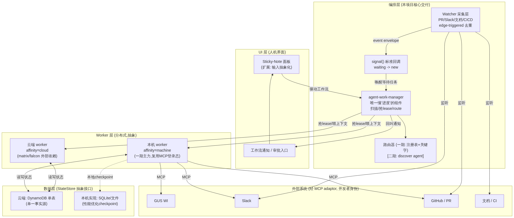
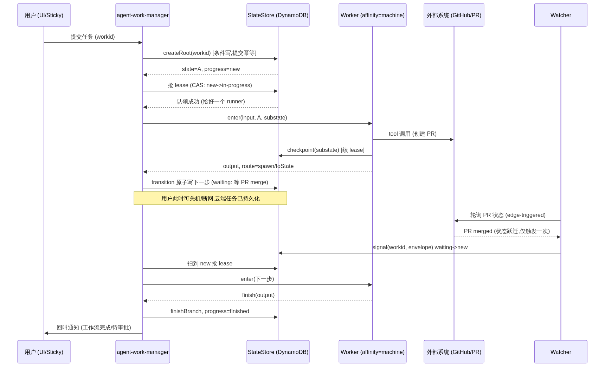
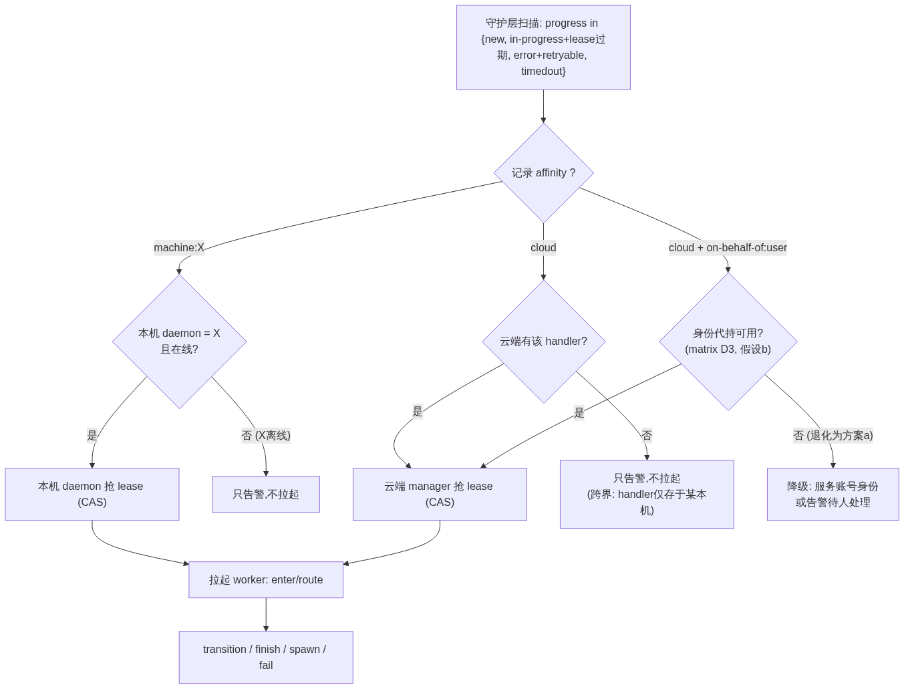

# 分布式 AI Agent 编排系统 — 项目可行性报告

> **版本 V1** · 2026-08-09 · 面向投资人与公司高层
> 作者：项目负责人（Salesforce，TCM）
> 读者：投资/资源决策层、工程负责人、FDE 团队
> 目的：为「分布式 AI Agent 编排系统」争取立项资金与工程资源，给出可信的落地路径与商业前景，而非泛化的技术介绍。

---

## 0. 执行摘要（Executive Summary）

**一句话定位**：我们要造的不是又一个 AI agent，而是让**任何 AI agent / skill / 脚本能够 7×24 无人值守、幂等、断点续跑、并被统一编排**的"分布式操作系统层"——先在公司内部把工程师的研发效率规模化，再沿清晰的产品化路径走向商用。

**为什么是现在（Why now）**：
- 公司已把 Claude Code / opencode 铺成开发平台，工程师已自发写出大量 skill / agent / workflow，但它们**半自动、非幂等、断了要从头跑、界面对非专业人士恐怖**——价值被"人必须全程盯着"这一条锁死。
- `matrix`（falcon 上的云端托管平台）即将解决"AI 工具无处 7×24 托管"这一痛点。**托管解决了"在哪跑"，但没解决"跑不稳、断了续不上、多任务管不住、消息触达不到人"**——后者正是本项目的空位。

**早期信号（须诚实标注，见 §2 与决策 D5）**：作者本人用自建的一套原型工具（wi-researcher/wi-worker 自动化 + sticky-note 人机界面 + WI-chatter 状态持久化 + PR/Slack/GUS 监听 + 本机带登录态的 job scheduler），已能**同时并行推进 4–5 个 WI、全程无需在 CLI 内交互**，Engineer360 口径下产出约为团队他人的 **3×**。这是 **n=1、作者本人、归因未隔离**的早期个人信号，不是产品级结论；报告据此提出**可规模化验证的试点假设 + 度量方案**（§2c、§3a），把它当立项理由而非既成事实。

**一期交付（本报告核心，见 §3a）**：面向**公司内部工程师**，交付一个能把"WI 全自动推进"规模化的编排器 —— 云端单一事实源的状态持久化、本机/云端统一的 worker 调度（affinity 模型）、边缘触发的信号采集层、以及最小 SDK 内核（状态存储 skill + handler 契约）。**人类只做决定、审查与验收（承担责任），AI 做工作。**

**边界诚实（见各决策）**：
- 云端 7×24 托管依赖 `matrix`/`falcon`——**外部依赖，非本项目自有交付**（D3、痛点 1）。
- 一期不自建鉴权，复用 MCP adaptor 的机器本地登录态，以**开发者本人身份**调外部系统——因此一期主力是 `affinity=machine` 的**本机 worker**，"无头"的前提是"连接已认证未过期"（D2）。
- "断网"刻意收窄为**中断容错（关机/重启/抖动后自动续跑）**，不承诺**断网执行**（D1）。

**我们要的（Ask）**：见 §3 的分期与成本——一期以现有工程师小队 + `matrix` 依赖为前提，目标是把"3× 个人信号"变成"多人可复现的团队效率提升"，并沉淀出可被 FDE 带向客户、可被 Salesforce 产品线复用的编排内核。

---

## 术语表（Glossary）

沿用 `工作流模版.md` 与设计备忘 D1–D5 的既定术语，先钉死以免全文漂移：

| 术语 | 含义 |
|---|---|
| **Worker** | 被编排的**可执行单元**，形态无关：LLM agent / skill / command / Step Functions / 纯脚本皆可，只要遵循 handler 契约。 |
| **handler** | 状态机里的纯函数角色 / 数据模型字段（`enter` + `route`）。实体叫 Worker，字段/角色叫 handler。 |
| **manager** | 唯一懂"进度"的组件（`agent-work-manager`）：扫描未完成任务、抢 lease、喂上下文、收 output、推进状态。 |
| **branch / branchId** | 任务树内的分支（根 = `0000`）；fan-out 子任务 = 新 branchId。 |
| **workid** | 任务树唯一标识，兼**提交幂等键**。 |
| **lease** | 乐观锁（CAS），保证同一分支同一时刻恰好一个 runner。 |
| **substate / progress** | worker 自定义的状态内 checkpoint / 系统的生命周期枚举（`new/waiting/in-progress/finished/error/timedout`）。 |
| **affinity** | 运行位置亲和：`cloud` \| `machine:<id>`，决定由云端 manager 还是本机 daemon 认领。 |
| **submitter** | 任务提交者，既是检索键也是隔离边界（per-submitter 访问隔离）。 |
| **Watcher** | 信号采集单元（PR/Slack/文档/CI），边缘触发去重，把事件喂给编排器。 |
| **StateStore** | 状态持久化抽象接口：云端实现 = DynamoDB，本机实现 = SQLite/文件。 |
| **matrix / falcon** | 公司内部云端托管平台（外部依赖，非本项目交付）。 |
| **MCP adaptor / Suite Manager** | 在本机维护每连接鉴权的组件，一期鉴权复用它。 |

---

## 1. 一期架构

### 1a. 架构图与组件职责

一期系统分五层：UI 层、编排层（**本项目核心交付**）、Worker 层、数据层、外部系统。核心命题是「**manager 是唯一懂进度的组件，worker 是可被随时拉起的纯函数**」——这条约束是幂等与断点续跑得以成立的支点。



> 源文件：`diagrams/v1-architecture.mmd`（可重渲染）

| 层 / 组件 | 职责 | 一期交付边界 |
|---|---|---|
| **UI 层 — Sticky-Note 面板** | 人机界面：拉取输入（当前是 GUS WI）、驱动工作流、及时通知用户工作流状态与待办/待审批。基于现有 `tcm-toolkit/sticky-note` 扩展。 | 一期做「输入抽象化」（从写死 GUS WI 抽象成可配置输入源）；图形化流程编辑锁远期。 |
| **UI 层 — 工作流通知 / 审批入口** | manager 回叫的落点：告诉用户"该你做决定了"。人类在此审查、验收、承担责任。 | 一期做通知 + 审批点；富交互留后续。 |
| **编排层 — agent-work-manager** | **唯一懂进度**。主循环：扫描未完成任务 → CAS 抢 lease → 读上下文 → 拉起 worker → 收 output 跑 route → 原子写下一步。守护职责：把卡住的任务重新变成可认领（重置 lease / bump attemptCount / 改 progress），业务逻辑永远由 worker 跑。 | **一期核心自研。** 云端 manager 认领 `affinity=cloud`，本机 daemon 认领 `affinity=machine:自己`。 |
| **编排层 — 路由器（Router）** | 把"用户想要的功能"映射到具体 handler。 | **一期降级为注册表 + 显式路由 + 关键字匹配**；「discover agent 自主语义找 handler」是开放研究问题，挪二期。 |
| **编排层 — Watcher 采集层** | 监听外部信号源（PR/Slack/文档/CI），**边缘触发（edge-triggered）去重**——仅状态跃迁时 fire。`watch-pr` 为参考实现，一期泛化为通用 Watcher 契约。 | 一期做 3–4 个预定义 watcher；watcher 注册中心留二期。 |
| **编排层 — signal() 标准回调** | Watcher 不直接拉 worker，而是把统一 event envelope 通过 `signal(workid, branchId, envelope)` 喂给编排器，把 `waiting → new`，由 manager 下一轮自然拉起。 | 一期定死 envelope schema + `signal()` 契约。 |
| **Worker 层 — 本机 worker** | `affinity=machine`，复用本机 MCP 登录态、以开发者本人身份调外部系统。**一期全自动脱机的主力。** | 一期主力。 |
| **Worker 层 — 云端 worker** | `affinity=cloud`，跑在 `matrix`/`falcon`。纯计算/读公共数据一期可跑；以用户身份操作外部系统取决于 matrix 身份机制（D3 OPEN QUESTION）。 | 能力边界随外部依赖，标注风险。 |
| **数据层 — StateStore 抽象接口** | 状态持久化。**云端实现 = DynamoDB 单表（单一事实源）**；本机实现 = SQLite/文件（仅作性能优化 checkpoint，非事实源）。同一接口两种实现，让"本机/云端统一编排"真正成立。 | 一期做 DynamoDB 实现 + StateStore 接口；本机 SQLite 为可选优化。 |
| **外部系统（经 MCP adaptor）** | GUS WI / Slack / GitHub-PR / 文档-CI，均以**开发者身份**经 MCP adaptor 访问。 | 一期复用 MCP，不自建鉴权（D2）。 |

**为什么这样分层**：worker 的正确性、tool 幂等、语义判断下推给 worker；持久化、幂等状态转移、并发互斥、重试、审计由编排层保证（承诺边界见 `工作流模版.md` §1）。这条"机制/声明分离"让新 worker 的开发者只需声明状态机，不必重造持久化——这是**降低开发门槛**与**二期 SDK**的地基。

### 1b. 消息通讯时序图

下图展示一个典型 WI 全自动推进的时序：提交 → 幂等建根 → CAS 认领 → worker 执行并 checkpoint → 转移进入 `waiting`（等 PR merge）→ **用户此时可关机/断网** → Watcher 边缘触发捕获 PR merge → `signal()` 唤醒 → manager 续跑 → 完成回叫通知。这条时序正是"**中断容错**"（D1）落地的证据链：单一事实源在云端，任何一步崩溃都能从最后 checkpoint 续跑，无需人从头重来。



> 源文件：`diagrams/v1-message-seq.mmd`

**信号层的核心洞察（决策 D4）**：`watch-pr` 已隐含一套完整的信号 watcher 契约。一期将其泛化为通用 **Watcher 五要素契约**，而非每种信号各写一套：

| 要素 | watch-pr 体现 | 泛化概念 |
|---|---|---|
| 源 + 订阅 | PR url + watch-items | `source` + `event-types` |
| 轮询调度 | crons + job-scheduler（登录态长驻） | 统一 poll 调度 |
| **边缘触发** | 快照 diff，仅状态**跃迁**时 fire（merged 只触发一次） | **去重的本质 = edge-triggered，非 level** |
| 回调 | `callback` 命令 + 变量替换 | 信号如何投递（一期标准化为 `signal()`） |
| 生命周期 | create/watch/delete/list + expire + `job-id=hash(输入)` 幂等 | 注册/注销/自清理 |

**统一 event envelope（一期必做，独立于是否用 SQS）**：
```
{ source, event-type, subject-id (如 pr-url), dedup-key, payload, timestamp, target-workid? }
```
无论本机回调 push 还是云端 SQS pull，fire 出的事件都用同一 schema——避免二期整合时全量返工。

**传输：一期本机回调 push，云端 waiting 唤醒按需 SQS**（D4）。`watch-pr` 现为回调 push（fire → 直接跑 callback，同步、点对点），本机 `affinity=machine` worker 已验证跑通、更简单；SQS（解耦、可持久、可重放）的真正价值在云端——`affinity=cloud` 的 `waiting` 任务靠"事件到达→唤醒"。二期再统一到事件总线。

### 1c. 数据存储的元数据结构

单张 DynamoDB 表（云端实现），`PK = workid`，`SK = 层级 process-id`。整棵任务树共享同一 PK，`Query(PK)` 一次拉出全树。完整设计见 `工作流模版.md` §2；下表为报告读者摘录关键字段，并标注 D1/D2 新增字段。

| 字段 | 类型 | 归属 | 说明 |
|---|---|---|---|
| `workid` | PK | 系统 | 任务唯一标识，兼**提交幂等键**（同 workid 重复提交只建一次树，外部拿到 exactly-once） |
| `processId` | SK | 系统 | `{branchId}#{stepIndex}`：分支命名空间 + 分支内步序，压进一个 key |
| `parentSk` | string | 系统 | 派生本分支的父步骤 SK（子任务血缘回溯） |
| `handler` | string | 系统 | 该记录由哪个 worker 处理 |
| `state` / `substate` | string | worker | 大阶段状态 / 状态内 checkpoint（JSON） |
| `progress` | enum | 系统 | `new/waiting/in-progress/finished/error/timedout`，manager 据此判断可否拉起 |
| `retryable` | bool | 系统/worker | 仅 `error` 时有意义：可重试 vs 终态（呼应 Saga 语义） |
| `input` / `output` | string | worker | 本步入参 / 产出（JSON），route 与审计读取 |
| `leaseOwner` / `leaseExpiry` | string / number | 系统 | 认领者 id / lease 过期戳，保证恰好一个 runner |
| `attemptCount` | number | 系统 | 已尝试次数，超阈值转终态 error |
| `stateFingerprint` | string | 系统 | state 名 + 状态图版本，恢复重放时校验，不匹配转终态告警（非确定性检测） |
| `createdAt` / `updatedAt` | number | 系统 | 创建 / 最后更新时间 |
| **`affinity`** | string | 系统 | **D1 新增**：`cloud` \| `machine:<id>`。守护层按 affinity 分区认领，跨界情形只告警不拉起 |
| **`submitter`** | string | 系统 | **D1 新增**：检索键 + 隔离边界，共享云表须做 per-submitter 访问隔离（连回 D2 鉴权） |

**结构化 vs 非结构化**：系统字段（本编排系统的约定）为**结构化**；`substate` / `input` / `output` 为 worker 各自约定的**非结构化** JSON——满足"数据存储应包括结构化的约定部分 + 每个 worker 不同的非结构化部分"（设计思路·数据层）。状态存储 skill 屏蔽 PK/SK 拼接与序列化，worker 只管业务对象。

### 1d. 选型调研（每个关键组件：≤5 候选 + 取舍）

> **调研纪律**：讨论每个关键组件前先调研开源社区与商业软件；能否完全满足需求、若不能需自研什么、若能则在**稳定性/扩展性/授权(License)** 上是否允许公司内部使用与商业化。

#### 组件 A：持久化执行 / 状态机内核（编排层的心脏）

| 候选 | ⭐/定位 | License | 能否满足 | 取舍结论 |
|---|---|---|---|---|
| **LangGraph** | ~39k，LLM agent 专用图/状态机 + checkpointer | MIT | 场景最贴近（thread_id/checkpoint_ns/subgraph ≈ workid/branchId/子分支）；**但无内置并发锁（"最后写赢"，官方承认的生产缺陷）、无显式状态、副作用不去重** | 若可引第三方依赖，**优先直接用**（配 DynamoDB checkpointer）；否则**借鉴其 subgraph 命名空间模型** |
| **DBOS** | ~1.5k，DB 背书的 durable workflow（步骤级 memoization） | MIT | 恢复算法最贴近：`(workflow_uuid, function_id)` ≈ `(workid, processId)`；check-then-execute、workflow_uuid 即幂等键、function_name 非确定性检测均可采纳 | 若可引依赖且要 Postgres 背书，**优先直接用**；否则**借鉴 check-then-execute 恢复算法** |
| **Temporal** | ~22k，通用 durable execution 集群（event sourcing + replay） | MIT | 设计模式来源：workflow/activity 分离 ≈ route/enter；heartbeat=lease+checkpoint；两类超时；signal/child ≈ waiting/spawn。**但重量级、需集群、event-sourcing 全量 replay 对 LLM 非确定性代价高且危险** | 已有 Temporal/SFN 集群则用托管；否则太重，仅**借鉴模式** |
| **AWS Step Functions** | 商业托管，公司已在 TCM 大量使用 | 商业(AWS) | 状态机 + 重试 + 补偿成熟，运维模式团队已熟；**但 LLM agent 的长推理链、动态 fan-out、步骤级 memoization 表达不自然，成本随状态转移线性上升** | 用于**粗粒度编排 / bulk 触发**（沿用 TCM 50-op 阈值模式），不做细粒度 agent 状态机 |
| **自研本模版**（`工作流模版.md`） | 轻量，DynamoDB 单表 | 自有 | 完全满足；显式 progress + lease+CAS + 分层 SK + 步骤级 memoization | **一期选此**——理由见下 |

**结论（组件 A）**：**一期自研本模版，并把 LangGraph/DBOS/Temporal 当参考实现直接借鉴**（尤其 DBOS 的 check-then-execute 与 LangGraph 的 subgraph 命名空间）。自研的**唯一正当理由**是：(1) 可能受合规限制不能引第三方 durable-execution 依赖；(2) 必须贴合公司现有 **DynamoDB + Step Functions + outbox/Lock TTL** 技术栈并复用现有运维模式。**本设计的抽象与业界收敛方向完全一致，这本身是合理性的强信号。** 稳定性/扩展性：DynamoDB 单表 + lease CAS 已在 TCM 生产验证（URS 7 实例、200 任务背压、1h Lock TTL）。授权：自有代码，商业化无 License 障碍；若最终选用 LangGraph/DBOS（均 MIT）亦可商用。
[OPEN QUESTION] 合规是否允许在公司内部/商用产品中引入 MIT 的 LangGraph/DBOS？若允许，一期可省掉自研持久化/恢复/幂等的全部工作量，**强烈建议先向法务/架构确认**——这是一期成本的最大单点变量。倾向：先确认；不能引则自研（技术已备好）。

#### 组件 B：云端 7×24 托管（"在哪跑"）

| 候选 | 定位 | 取舍结论 |
|---|---|---|
| **matrix / falcon**（公司内部） | 痛点 1 的既定解法，公司内部 AI 工具托管平台 | **一期依赖它**跑 `affinity=cloud` worker。**外部依赖，非本项目交付**——若未按期落地，云端 24×7 能力须标为排期风险，一期主力回退到本机 worker（D3、痛点 1） |
| **AWS ECS/Fargate + EventBridge Scheduler** | 通用容器托管 + 定时触发 | matrix 未就绪时的**技术退路**（自建最小托管），但重复造轮子，非优选 |
| **GitHub Actions（self-hosted runner）** | CI 化的定时/事件触发 | 轻量场景可用（尤其 PR/CI 类 worker），但非通用 agent 运行时 |

**结论（组件 B）**：绑定 `matrix`，并显式标注外部依赖与风险；不自建托管。

#### 组件 C：鉴权（"以谁的身份调外部系统"）

| 候选 | 定位 | 取舍结论 |
|---|---|---|
| **MCP adaptor / Suite Manager**（现状） | 机器本地 + 交互式登录建立 + 开发者本人身份；已支持 Claude Code/GUS(OAuth)/Google Workspace/Searchinator/DX Gateway/Slack | **一期复用**（D2）。不自建鉴权体系 |
| **server-side OAuth token 保管 + 刷新（自建/代持）** | 云端代持用户身份 24×7 | **二期目标**：突破一期"云端 worker 拿不到用户身份"的限制。一期不做 |
| **Salesforce Identity / Connected Apps** | 平台级身份 | 商业化 / 与 SF 产品耦合时的长期方向（§2d），一期不引入 |

**结论（组件 C）**：一期复用 MCP，带出三条硬边界（D2）：依赖 MCP 的 worker 打 `affinity=machine`；交互式登录 ≠ 无头长跑（OAuth 过期时"只告警不硬跑"，由人 Reconnect）；MCP 只解决"以谁的身份调"，不解决"谁能看云表里谁的任务"——per-submitter 访问隔离仍须做。

#### 组件 D：信号 / 消息传递（Watcher 与传输）

| 候选 | 定位 | 取舍结论 |
|---|---|---|
| **watch-pr 泛化（自研 Watcher 契约）** | 已验证的边缘触发 watcher + job-scheduler 登录态长驻 | **一期采集层选此**（D4），泛化为通用契约 |
| **AWS SQS (FIFO)** | 解耦、可持久、可重放的事件传输 | **云端 waiting 唤醒按需用**；TCM 已用 SQS FIFO，运维成熟。一期不全量上，二期做事件总线 |
| **AWS EventBridge** | 事件总线 + 规则路由 | 二期统一事件总线的候选，一期不引入 |
| **DynamoDB Streams** | 表变更驱动 manager 扫描 | manager 扫描"先轮询、量大再上 Streams"（`工作流模版.md` §7），一期轮询 |

**结论（组件 D）**：一期 = event envelope schema + Watcher 契约 + 3–4 个 watcher（PR/Slack/文档/CI）+ `signal()` 标准回调 + 本机回调 push（云端按需 SQS）。稳定性/授权：SQS/EventBridge 为 AWS 托管商业服务，公司已在生产使用，商用无障碍。

---

## 2. 优势、可行性与公司效益

### 2a. 竞品对比：我们的优势与改进点

**市场上确有相邻产品，但没有一个同时覆盖"LLM-native + 本机/云端统一 + 消息驱动人机闭环 + 面向非专业用户的编排"这四条。** 我们的差异化正在这个交集。

| 类别 | 代表 | 它做什么 | 缺口 / 我们的改进点 |
|---|---|---|---|
| **Durable execution 框架** | Temporal / DBOS / Restate | 通用持久化执行、故障恢复 | 非 LLM-native；无人机交互闭环；面向工程师写代码，不面向"驱动一个 agent 工作流"的终端体验 |
| **LLM agent 编排** | LangGraph / LlamaIndex Workflows / CrewAI / AutoGen | 多 agent 图/协作 | 单机/单进程为主；**无内置并发锁与显式状态持久化**（LangGraph 官方承认）；无本机/云端统一调度；无脱机断点续跑的运维层 |
| **通用工作流编排** | Airflow / Prefect / Dagster / Temporal | DAG 调度、数据管道 | 非 LLM 语义；面向数据工程师；无 agent 自主 route / spawn；无人机审批闭环 |
| **AI agent 托管平台** | LangGraph Platform / OpenAI Assistants / Vertex Agent Engine | 云端托管 agent 运行时 | 托管≠编排：不解决"多任务、断点续跑、跨本机/云端统一事实源、信号驱动人机回叫"；且多为外部云、公司合规受限 |
| **公司内部（现状）** | matrix/falcon + Claude Code + 自发 skill/agent | 托管 + 开发平台 + 零散工具 | **正是我们要填的空位**：有托管、有工具，但**无编排层**（幂等/续跑/多任务/信号/人机闭环），价值被"人必须盯着"锁死 |

**我们的四条护城河（改进点）**：
1. **LLM-native 的显式状态机**：显式 `progress` + `substate` + `stateFingerprint` 非确定性检测，比 LangGraph"靠 pending write 推断状态"可排查、可被外部工具消费。
2. **本机/云端统一事实源（affinity 模型）**：同一 StateStore 接口、同一 lease+CAS，本机 worker 与云端 worker 同表调度——竞品要么纯单机、要么纯云端。
3. **信号驱动的人机闭环**：Watcher 边缘触发 → `signal()` 唤醒 → 回叫通知 UI。这是"用户关机断网、工作流仍推进、到点叫人审批"的完整闭环，竞品普遍缺 UI/通知这一端。
4. **面向"驱动工作流"而非"写代码"的体验**：从 sticky-note 起步，把 CLI 的恐怖界面挡在用户之外——这是走向 FDE / 终端用户的产品化起点。

### 2b. 商业前景：能否包装为独立产品

**能，但要分阶段、诚实定位。** 商业化的产品形态不是"又一个 agent 框架"（那个赛道已拥挤且多为 MIT 开源），而是 **"让企业把已有 AI 工具变成 7×24 可靠数字员工"的编排 + 运维 + 人机闭环平台**——护城河在运维可靠性、企业身份/合规、以及非专业用户的编排体验，而非算法。

- **内部产品（一期，确定）**：面向 Salesforce 工程师的研发效率平台，先自证价值。
- **平台/SDK（二期，高潜）**：`工作流模版.md` 的 handler 契约 + 状态存储 + 消息层封装成 SDK，让公司内其他团队低门槛接入——这是"内部平台产品"的形态。
- **商用 SaaS（远期，愿景）**：模版 + 图形化界面 + 封装的持久化/消息/鉴权，降低企业客户"用已有 worker 组装自己工作流"的门槛。**商业化最大的变量是与 Salesforce 平台身份/Connected Apps/Agentforce 的耦合（见 2d）**——这既是壁垒也是 go-to-market 通道。
[OPEN QUESTION] 商业化路径是「独立 SaaS」还是「作为 Agentforce / Platform 的编排能力内嵌」？倾向后者：借 SF 既有分发与身份体系，避开与开源 agent 框架的红海正面竞争。此决策影响远期架构（鉴权、多租户），需产品/战略层拍板。

### 2c. 落地与反馈闭环：从内部起步 + 与 FDE 结合

**获取真实需求与反馈的路径（务实、低成本）**：
1. **Dogfooding 优先**：一期先服务本团队工程师的 WI 处理——需求方 = 使用方 = 反馈方，闭环最短。
2. **可核验的度量（Engineer360）**：以 WI 完成数、PR 周期时间为客观口径做多人对照（见 §3a 度量方案），而非自述。
3. **FDE 结合（真实客户场景的桥）**：FDE（Forward Deployed Engineer）常年在客户现场做定制自动化——他们是**把内部编排器带到真实客户用例**的天然通道。一期末期邀请 1–2 名 FDE 试用，用他们的客户场景反推 worker 抽象是否够通用；二期正式培训 FDE、收集客户用例（设计思路·二期）。
4. **反馈闭环工具化**：编排器本身产生的审计轨迹（append-only 全历史）就是产品分析数据——哪些 worker 常失败、哪些状态常卡、人工介入率多高，直接指导迭代。

### 2d. 与 Salesforce 产品线的耦合

耦合不是"顺带集成"，而是**放大器**——既能借 SF 产品分发本编排器，也能用本编排器给其他产品线增值：

| 产品线 | 耦合方式 | 价值方向 |
|---|---|---|
| **Slack** | 作为 AI 消息接收 + 工作流驱动界面（设计思路·二期）；Watcher 已监听 Slack | 双向：Slack 是天然的人机界面，替代恐怖的 CLI；为 Slack 增添"驱动数字员工"的能力 |
| **Tableau** | 作为工作流的输入/输出（设计思路·二期）；本项目源自 TCM，天然贴近 | 编排器为 Tableau 场景做自动化运维/数据流程；Tableau 可视化编排器的审计与效率数据 |
| **MuleSoft** | 作为连接不同 worker/工作流的管道（设计思路·二期） | MuleSoft 提供企业级连接器，扩展 worker 可触达的外部系统 |
| **Agentforce / Platform** | 编排器作为 Agentforce agent 的"持久化执行 + 多步编排 + 人机审批"底座 | **最具战略性**：Agentforce 解决"造 agent"，本项目解决"让 agent 可靠地长跑并被编排"——互补而非竞争。远期商业化的主通道（2b） |
| **GUS** | 一期输入源（WI）；Watcher 监听 GUS 状态 | 直接提升 SF 内部研发流程效率，自证 ROI |

**结论**：本项目对内是研发效率工具，对外是 Agentforce/Platform 的编排底座候选——两条线共用同一内核，降低重复投入。

---

## 3. 开发阶段与成本

### 3a. 一期（重点）：面向内部 Engineer

**产品形态**：一个内部编排器 + 已有 sticky-note 人机界面 + 少量预定义 worker/watcher。**用户旅程**：工程师在 sticky-note 选一个 WI → 编排器全自动推进（研究→写码→提 PR→等 review→修订→测试→回归）→ 断点续跑不需盯着 → 到"需要人做决定/验收"时回叫通知 → 人类审查并承担责任。

**要交付的能力（对齐设计思路·一期目标）**：

| 能力 | 交付内容 | 状态 |
|---|---|---|
| 状态持久化（StateStore） | DynamoDB 单表实现 + 接口抽象；`工作流模版.md` 的字段模型 + D1/D2 新增字段 | 模型已设计，需工程实现 |
| agent-work-manager | 扫描/CAS 抢 lease/route/守护层；affinity 分区认领 | 核心自研 |
| affinity 调度 | 本机 daemon 认领 `machine:自己`，云端 manager 认领 `cloud`；跨界只告警 | 见下图 |
| 最小 SDK 内核 | 状态存储 skill（`createRoot/checkpoint/transition/spawn/finish/fail/latest`）+ handler 契约（`enter`+`route`） | **提前到一期**（否则一期 worker 二期返工） |
| Watcher 采集层 | event envelope schema + Watcher 契约 + 3–4 个 watcher（PR/Slack/文档/CI）+ `signal()` 回调 | watch-pr 泛化 |
| 路由器 | 注册表 + 显式路由 + 关键字匹配（非自主发现） | 降级版 |
| worker 鲁棒性 | 完善 wi-researcher/wi-worker，提高处理鲁棒性 | 基于现有原型 |
| 人机闭环 | sticky-note 输入抽象化 + 回叫通知/审批入口 | 扩展现有 |

**affinity 调度决策流**（哪台机器/云端认领哪条任务，跨界如何只告警不硬跑）：



> 源文件：`diagrams/v1-affinity-scheduling.mmd`

**度量方案（把 "3×" 从个人信号变成可复现结论，决策 D5）**：
- **诚实定位**：现有 "3×" 是 **n=1、作者本人、归因未隔离、代理指标（WI 数 + 代码量）** 的早期信号，是立项的**待验证假设**，不是产品级结论。
- **验证设计**：一期招募 **3–5 名工程师试点**，Engineer360 口径下做**对照/前后对比**（WI 完成数、PR 周期时间、人工介入次数）；区分"工具贡献 vs 个人因素"；辅以人工介入率、worker 失败率等编排器自身审计指标。
- **成功判据（示例）**：试点组相对对照组 WI 吞吐提升可统计显著（例如 ≥1.5×，而非坚持 3×）、人工介入率随迭代下降。

**一期成本与依赖（供决策层评估）**：
- **人力**：以现有工程师小队为主（作者已有可运行原型，降低从零风险）。
- **关键外部依赖**：`matrix`/`falcon` 云端托管（痛点 1）、`matrix` 身份机制（D3）——**非本项目交付，须并行确认排期**。
- **最大成本单点变量**：组件 A 是否可引 LangGraph/DBOS（[OPEN QUESTION] §1d）——若可引，省掉自研持久化/恢复/幂等的大头。
- **一期不做**（明确降级，控制范围）：discover agent 自主发现、图形化编排界面、终端用户可用、自建鉴权、云端身份代持（若 matrix 不提供）、全量 SQS 事件总线。

### 3b. 后续各期蓝图

沿设计思路的分期，并接住一期埋好的扩展点（StateStore 接口、event envelope、handler 契约都是二期不返工的地基）：

**二期（平台化 + 消息统一 + SF 耦合）**：
- 统一 AI agent 模版为正式 **SDK**，改写现有 worker，降低开发门槛、降低 token 消耗。
- 完善消息/事件的监听、捕捉、分发 —— **全量统一到 SQS/EventBridge 事件总线**，watcher 注册中心；把更多工作流纳入自动化。
- **SF 产品耦合落地**：Slack 收发 AI 消息驱动工作流、Tableau 作输入/输出、MuleSoft 作 worker 管道。
- 处理 GUS WI 以外的工作流。
- **鉴权升级**：云端 server-side OAuth 代持用户身份 24×7，突破一期"云端 worker 拿不到用户身份"的限制（D2/D3）。
- 培训 FDE，收集客户用例，反推产品通用性（2c）。

**远期（商业化）**：
- **discover agent**：语义路由自主找 handler（一期的注册表升级为智能发现）。
- **图形化 AI 开发界面**：拖拽状态机 + 组装工作流，定义 agent/skill 只需声明状态与迁移。
- **终端用户可用**：模版 + 图形界面 + 封装的持久化/消息/鉴权，让 Salesforce 客户低门槛组装自己的工作流——把 AI 从"chatbot"变成"可编排的数字员工"。
- **商业化形态**：优先作为 Agentforce/Platform 的编排能力内嵌（2b OPEN QUESTION）。

---

## 4. 风险登记与外部依赖（Risk Register）

| # | 风险 / 依赖 | 影响 | 缓解 |
|---|---|---|---|
| R1 | `matrix`/`falcon` 托管未按期落地 | 云端 24×7 能力缺失 | 一期主力回退到 `affinity=machine` 本机 worker；准备 ECS/Fargate 技术退路 |
| R2 | `matrix` 身份机制 = (a) 调用门禁而非 (b) 代持（D3 OPEN QUESTION） | 云端 worker 无法以用户身份操作 GUS/Slack | 按 (b) 强假设设计，降级 (a) 容易；给出服务账号身份退路 |
| R3 | 合规不允许引入 MIT 的 LangGraph/DBOS（§1d OPEN QUESTION） | 需自研持久化内核，一期成本上升 | 技术已备好（`工作流模版.md`）；先向法务/架构确认 |
| R4 | MCP 连接 OAuth 过期，无头 worker 无法自弹登录（D2） | 脱机长跑中断 | "只告警不硬跑"，由人 Reconnect；二期云端代持解决 |
| R5 | "3×" 效率无法在多人复现（D5） | 立项 ROI 论据削弱 | 试点对照 + 保守成功判据（≥1.5×）；即便部分成立仍有价值 |
| R6 | 共享云表 per-submitter 隔离缺失（D1/D2） | 跨 submitter 数据越权 | 一期最简：云凭据按人隔离，worker 只读写自己 submitter 分区；二期 API gateway |
| R7 | 范围蔓延（discover/图形化/终端用户被提前拉进一期） | 一期延期 | 本报告已明确降级清单（§3a"一期不做"），严格守边界 |

## 5. 待决问题汇总（Open Questions）

供 human comment / reviewer 在下一版收敛：
- **OQ-1（§1d，最高优先）**：合规是否允许引入 MIT 的 LangGraph/DBOS？决定一期是否自研持久化内核——一期成本的最大单点变量。倾向：先确认；不能引则自研。
- **OQ-2（D3/R2）**：`matrix` 的"本机个人鉴权 → 云端 worker"是 (a) 调用门禁还是 (b) 身份代持？决定 `affinity=cloud` worker 能否以用户身份操作外部系统。工作假设：(b)。**待用户向 matrix 团队确认**（design-notes 唯一遗留 OPEN QUESTION）。
- **OQ-3（§2b）**：商业化路径是独立 SaaS 还是内嵌 Agentforce/Platform？倾向后者。需产品/战略层拍板。

---

## 附录：设计依据与决策追溯

本报告的关键设计取舍均可追溯到 `design-notes.md` 的决策记录：
- **D1**：本机 worker 恢复主体 = 本机 daemon；单一事实源 = 云端；`affinity`/`submitter` 字段；"断网"= 中断容错而非断网执行。
- **D2**：一期鉴权复用 MCP（开发者本人身份、机器本地）；三条硬边界。
- **D3**：matrix 云端 worker 身份机制（外部依赖 + OPEN QUESTION，工作假设 (b) 代持）。
- **D4**：消息/信号层 = watch-pr 泛化的 Watcher 契约 + event envelope + `signal()` 回调；一期本机 push、云端按需 SQS。
- **D5**：效率证据度量口径（诚实标注 n=1 + 试点验证路径）。
- 底层状态机/持久化/幂等/恢复算法：`工作流模版.md`（§1–§8，含 LangGraph/DBOS/Temporal prior-art 对照）。
